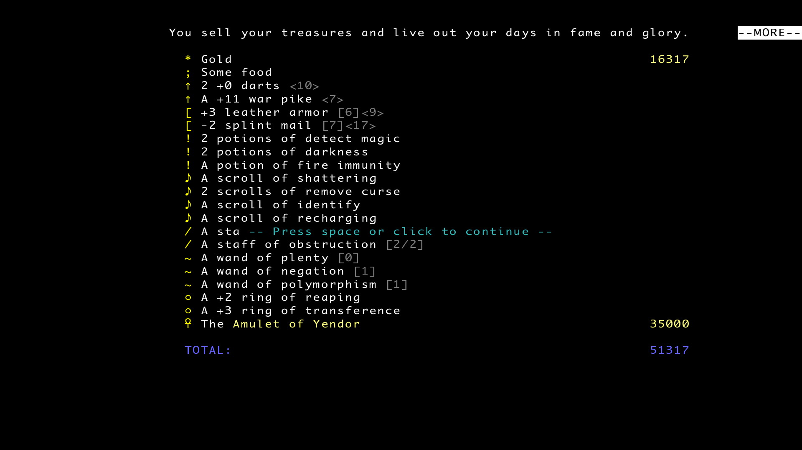
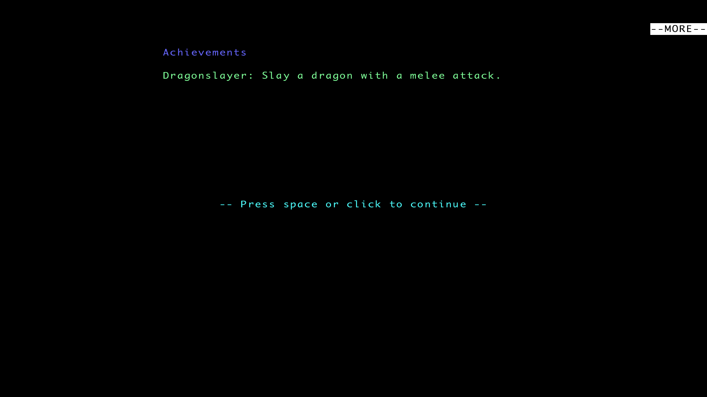

## Quick Overview

People often recommend Brogue as the first traditional roguelike you should play. Supposedly it’s not that deep, has fewer mechanics, and is almost considered “easy.”

Yeah, none of that is true.

Sure, there’s no dedicated “clean your ears” button like in ADOM, but the game still has plenty of mechanics going on, and there’s more than enough stuff to lose hours reading about on the wiki.

The monster roster isn’t huge, but every enemy feels distinct. Each one has some nasty gimmick, and every fight demands its own approach. Weapons aren’t just different damage numbers either. Every weapon comes with its own quirks and positioning requirements.

And that’s the core of the game.

Brogue lives and dies by its combat, but not in the “walk into enemy until one of you dies” kind of way.

The level generation is some of the most beautiful I’ve seen in the genre.

There’s color everywhere — treasure vaults, lakes of water and lava, glowing terrain, strange vegetation. Floors don’t just look like “floor” either. You walk across grass, carpets, swamps, mud, crystal formations, and all kinds of other terrain that make each level feel distinct.

It’s a massive step forward from the classic “rectangular rooms connected by corridors” dungeon design.

## First Death

Totally out of nowhere, my first death came on depth 6. If only I'd known how far I'd get — and how many more times I'd die much sooner.

It was a Goblin Conjurer. He was just chilling in a big, well-lit room, completely unaware I was coming for him.

But the moment I got close, he summoned a horde of spectral blades. I already knew that killing them only made him summon more, so I figured I wouldn't bother — straight for the goblin it was.

Reading my play like a book, the goblin booked it. While I was chasing him down, the spectral blades were stabbing me in the back. What I didn't know back then was that they're faster than you — fast enough to both catch up and get their hits in.

When death started breathing down my neck, I went into panic mode, chugging every unknown potion I had. But nothing worked. No magic happened that day.

## What I Learned After the First Hour

As tradition demands, I died to an eel on the second floor.

Water is now terrifying. If there’s a lake nearby, I want absolutely nothing to do with it. Cross it as fast as possible and pray.

Unlike a lot of roguelikes, there’s no XP system and no character levels here, so you don’t actually have to fight everything you see. What *is* mandatory, though, is fully exploring the dungeon.

The entire game revolves around the items you find, so the more of the floor you uncover, the better your chances of surviving later.

Positioning matters a lot too. The game doesn’t allow diagonal attacks near walls, which means only two enemies can hit you while you stand in a doorway. It’s one of the safest spots in the game, almost like fighting in a one-tile corridor.

## What I Learned After the First Five Hours

The early floors get cleared quickly. At this point I was basically mashing the auto-explore key to speed through them.

I’d already figured out tactics for every monster appearing up to depth 4. Nothing too complicated, but each enemy needed its own approach, and once those patterns clicked, the early game became pretty stable.

Floor 4 is where you can finally start drinking unidentified potions and reading scrolls. That’s also where the direction of the run starts taking shape.

What items are you getting? Which potions rolled lucky? Do you have tools for single-target fights, or for enemies that refuse to walk into obvious choke points?

Against Jellies, the best tactic is hiding in a doorway so their clones can’t surround you from every side.

Against Goblin Conjurers, stairs work wonders. Go up or down a floor and wait for the goblin to follow you.

When he arrives, he comes alone — without his spectral blades — so you get a chance to kill him before he summons anything.

At this point I could consistently reach depths 7, 8, and sometimes 9 — which is exactly where the game started killing me again.

Some deaths came from completely new enemies I’d never seen before. Dar Blademasters, for example, apparently took personal offense to the concept of running away. Once one of them noticed me, escaping stopped being an option.

And then there were ogres. Of course there were ogres.

One run gave me an especially stupid situation. I had two possible paths forward.

One corridor had a sleeping ogre in it, except he woke up the moment I tried to sneak past.

The other path had a statue that animated as soon as I approached it.

And naturally, the statue contained another ogre.

So what exactly was the correct play there?

## What I Learned After the Twenty Hours

So the game runs on items — they're the only way to upgrade yourself. By depths 6–7, enemies start showing up that you simply can't beat with your starting gear. You'll have to pick something to commit to.

Items *must* be upgraded. The simplest strategy is to pick one thing and dump every Scroll of Enchanting into it. The other option is to spread the levels across several items. It's a choice between having a +12 axe or a +6 axe with a +6 ring. Only one way to find out what works — try it.

Here's my ID strategy. For the first 4 floors, hoard everything you find. Let it sit in your inventory, it's not bothering anyone. By depths 3–4 your inventory will be full — that's when identification begins.

Start with potions. The big one is Potion of Detect Magic. It lets you skip negative potions and immediately shows which equipment is cursed or blessed. Cursed stuff — throw it away immediately, don't waste inventory space or time. Blessed gear you can either commit to enchanting or just use enough to identify naturally: 20 kills for weapons, 1000 steps for armor, 1500 steps for rings.

Before reading scrolls, keep a few things in mind:
- If you find a Scroll of Enchantment — do you have an item worth spending it on? These are the most valuable scrolls in the game, wasting even one hurts.
- If it's a negative scroll — will it cause problems? There are only two bad kinds, and for both you're better off reading them on a cleared floor, - preferably not deeper in the dungeon while summoned monsters are weaker.
- If you get Scroll of Protect Weapon or Protect Armor — is the weapon/armor you're wearing worth the scroll?
- If you find Scroll of Negation — is there a vault or enchanted items on the floor that you'd hate to see lose their upgrades?

You get the idea. Potions you can chug without much worry, but scrolls are far more valuable — save them.

Wands and staffs should be tried out as soon as you find them to figure out what they do. Just be ready for negative effects — like healing a monster or creating a clone of it. Nothing worse than making an enemy invisible at the worst possible moment.

Among dangerous new enemies, the Revenant shows up — immune to normal weapons. You need magic or special abilities to deal with it. It's common enough that you won't have a Potion of Descent for every encounter.

One more tip: don't ally yourself with a Salamander. I had one as a companion once, and we walked into a gas trap. The gas ignited instantly — courtesy of my friendly Salamander — and I barely survived the explosion. Not thinking twice, already seeing the trap, the Salamander decided to stand on it again, triggering a second blast that buried us both for good. Needless to say, I never made that mistake again.

## To the Amulet and Back Again (Story of a Single Run)

Right away, I should say this run was full of pain and suffering. Not the cinematic kind. The quiet kind: muscle memory of wrong turns, the seed number stopping at a grudge, the cursor hovering over “New Game” long after you promised yourself you’d quit for the day.

I’d already managed to beat the game using a pile of save files, and at one point I even cleared Bullet Brogue without using saves at all. But this particular run was brutal. I’m not even going to admit how many times I restarted it. Way too many.

Still, I wanted to finish this exact run, even if the item drops weren’t especially generous.

But hey, a win is a win.

The game actually lets you restart using the same seed. You could even say Brogue encourages this kind of strategy — if you start a New Seeded Game, it automatically selects your last seed.

So if anyone wants to experience my suffering personally, here it is: *427364548*.

### Depth 1

Pretty standard opening floor. Jackals, rats, kobolds — business as usual.

There was also a vault, and I immediately grabbed a war pike (+0) from it. Turns out there was also a leather armor (+3 of mutuality) inside, but of course I didn’t know that at the time.

I like weapons. And even though I know heavy weapons never carry runes, I picked the war pike anyway. Slow commits. No safety net. In a game that punishes hesitation, I tied my own hands on purpose.

### Depth 2

Four Bloats, spawned almost back-to-back. The gas didn’t just pool — it crept. I backed into a dead end, counted turns, listened for the hiss to thin out. 
One wrong step and the screen blurs. I took none.

There was also a monkey that stole one of my potions, but by now I already know chasing monkeys is almost never worth it. Those little bastards know the dungeon layout better than I do and have no problem running circles around entire floors.

What they *don’t* know how to do is dodge darts.

So I got my mysterious potion back.

One floor below, I immediately found another monkey trapped in a cage. Of course I freed it. A helper like that is never useless.

To stop it from dying instantly, I even healed it with a Bloodwort stalk. We’ll see how long it survives.

Well then, time to start gambling on unidentified potions.

First attempt: bad idea. Potion of confusion.

Then strength, immediately followed by incineration.

The monkey apparently sensed disaster coming and wisely backed away. Meanwhile I had to sprint into a lake to put myself out.

After healing up a bit, I kept drinking.

And then came potion of descent.

Thankfully I’d been testing potions near a staircase, so climbing back up wasn’t too hard.

Next came telepathy and potion of life. At least those were useful.

Still no Detect Magic. The scrolls sat in my pack like unopened threats. I’d have to gamble blind later. Of course I would.

### Depth 4

This was the floor where our little team decided fighting a Pink Jelly in the open was a good idea.

The result was predictable. One wrong angle, a split, and the floor was quiet again.

While I was still cleaning up the remaining jelly clones, a Goblin decided it was the perfect moment to start hunting me down. I definitely didn’t have enough health left for a straight fight, so I ended up running circles around the floor until I found a Bloodwort stalk.

After positioning myself so only I was standing inside the healing gas, I finally dealt with the Goblin.

### Depth 5

That’s it. The tutorial zone was over. 

The dungeon stopped testing me. It started counting my mistakes.

From this point on, the enemies stopped being polite.

There was no way I was getting further with starter gear, so I dumped every Scroll of Enchantment I had into the war pike, bringing it up to +3.

I still didn’t really have enough strength to use it properly, but technically I *could* hold it.

I’d just have to put my entire body weight behind every swing. 

Slower commits. Missed turns meant punishment. But the damage paid for it.

### Depth 6

The new floor introduced me to a new enemy: Vampire Bats.

This is one of those enemies that immediately checks what kind of build you’ve brought with you. A starter dagger won’t handle them.

Thankfully, the war pike worked perfectly.

I skewered them like kebabs.

Later I ran into an entire group of Acid Mounds. Neither my armor nor my weapon were remotely prepared for that.

Good thing I’d already identified incendiary potion. One Molotov cocktail later, the entire group was on fire.

They didn’t even manage to reach me before roasting alive together.

Then I finally got Detect Magic. The leather armor (+2) slid on like it had been waiting.

I burned the bad scrolls in lava before they could talk back. Packed the rest.

Deeper floors don’t care how prepared you feel. But at least I’d know what I was walking into.

### Depth 7

Right near the staircase I ran into an entire Goblin squad.

I had absolutely no intention of fighting them, so instead I tossed a potion of confusion into the group. Conveniently, there was a chasm nearby.

Confusion hits. They don’t stop to think. They just keep walking. One by one, they step over the chasm edge and drop.

This was also where I found a Scroll of Protect Weapon.

From that point on, acid enemies stopped being a problem. My armor, on the other hand, remained unprotected for the entire run, so I constantly had to work around that.

Meanwhile, the game kept giving me Scrolls of Protect Weapon. I think I found four of them total.

Four Scrolls of Protect Weapon. One pike. The dungeon clearly had a favorite.

### Depth 8

First Ogre. In early runs, these forced a retreat or a panic scroll. Those are second dungeon check if I'm ready to mid game.

Now, +5 pike and +2 armor just chewed through it. 

The build finally clicked.

### Depth 9

I walked straight into a trap set by a Spider.

The bastard shoots webs at basically any angle, unlike most enemies that only attack diagonally or orthogonally. It also spits poison, because apparently webs alone weren’t annoying enough.

Other than that, not too dangerous.

Eight eyes watching. None of them mattered if I kept my distance. Angle, step, thrust. Repeat.

### Depth 10

Deep in the dungeon, I ran into a Dar Blademaster. Fast. Weapon already drawn. Theoretically, my pike should drop him in two swings — if I could actually hit him. Reality took six of my attacks and four of his. I barely walked away.

Right after him, a Wisp. Bright blue, doesn’t deal direct damage, just ignites everything it touches. Including me. I backed into a pool, sizzling, lost a sliver of health putting myself out.

Walking around half-dead isn’t smart. The dungeon doesn’t forgive that kind of risk.

I waited. Let the wounds close. Didn’t regret it.

Next: a Wraith. Probably leftover from some adventurer who didn’t make it. Its chill locked onto me, slowing every step. Wraiths flee when they’re low. You can’t outrun them with short weapons. The pike didn’t need to chase.

### Depth 11

Another Wraith immediately. This one wasn’t scared of reach. When I was down to one hit of health, I chugged a Potion of Life. Rare stuff. But the enemy wasn’t cheap either. Four of its strikes would drop me.

In the marshes, a Bog. Grabs you, won’t let go. Water’s a death trap now, eels aside.

Another elf. Faster than the last. Dying, I popped a Teleportation Charm. Big gamble. Never know where you’ll land. Luck held.

And again—a Wraith. Another brutal fight. Barely survived.

Third time on this floor I had to stop and wait for my health to tick back up. Relentless. And this isn’t even halfway down. Every step costs something.

### Depth 12

Trolls start showing up here. Big, regenerate fast, hit hard. Three of its strikes and the run’s over. I’d need four of mine to drop it.

No choice but to push forward. Gotta risk it.

Potion of Life saves me again. Last one in the pack. From here on out, it’s just me, the pike, and whatever drops.

Ran into a Nauseous Zombie. Another dead adventurer who didn’t get to rest. Harmless alone, but the nausea lingers long after it’s dead. Screen warps, swings feel heavy, accuracy drops. Just had to push through the debuff.

### Finale

And this was the final gear setup I carried all the way back to the surface.

I probably could’ve sold it to the next unfortunate adventurer for a decent profit, but honestly I’ll keep it as a souvenir instead.

I even got an achievement somehow.

Pure luck, honestly.

