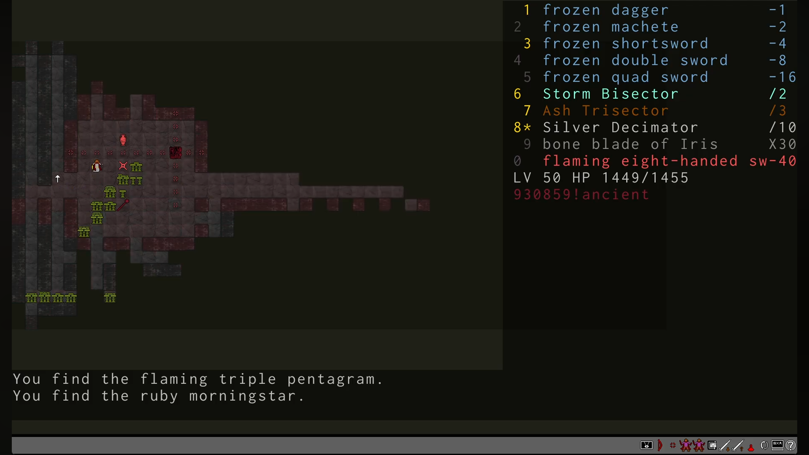

## Quick Overview

I've played this game before, a long time ago, probably around the time it first came out. I even made it to the first boss, maybe even beat it—I honestly don't remember anymore. Back then I played as Echidna. In my opinion, it's the easiest class, with nothing more than basic arithmetic.

This time I want to play as a human, so I can get a better feel for the different weapons and materials. I don't even want to try the other classes—I think they'll be too difficult.

Beating the game is probably going to be really hard. It's completely fair—there's no randomness. Every fight is pure tactics. No hoping for a lucky potion, scroll, or anything like that. Just math. That's also why a successful run can take so long: the slower you do the calculations, the longer the run.

Right now I have no idea how to use stunning weapons properly. Are they useful for anything besides reducing incoming damage? I'll have to figure that out.

## First Death

Human, Floor 9. I had just gone downstairs when I immediately found myself next to four hydras, ranging from 5 to 40 heads. By that point I had six weapons, but the hydras were already building up serious resistance against them.

I barely used my Scrolls of the Big Stick. I still hadn't realized that +7 weapons become too weak—the enemies' resistances grow faster than your weapons keep up as you descend.

I got torn apart almost immediately, barely a minute after reaching the floor. While I was trying to figure out how to deal with the 5-headed hydra, the others surrounded me and killed me in three turns.

I didn't use a single consumable. Looking back at it now, I don't even feel like facepalming. It's just sad. No idea why I was in such a hurry.

## What I Learned After the First Hour

The first few floors are very easy. You barely have to think—just pick the weapon that chops off all the heads at once, and the floor is done. On the bright side, the early game isn't nearly as intimidating as I expected. Getting through the opening levels is pretty straightforward.

Things get interesting after that. I assumed hydras would only resist the couple of elements that increase their number of heads. I was wrong. They build resistance to every element except one, and it grows very quickly. Weapons that cut off 5–6 heads become useless after about 15 minutes of play—hydras start regrowing 7–8 heads at a time. And with only four hands, it's hard to keep the right set of weapons. Even by Floor 6 the game gets tough. There are plenty of consumables, but having the ones you actually need is another matter. I've already died around five times and I'm still nowhere near the first boss. Everything seems simple, everything makes sense, but I just can't put it all together yet.

Stunning isn't as bad as it first seemed. I picked up an axe, and it works pretty well. Positioning matters—you can step back a little and wait for the stunned heads to recover before chopping them off again.

You don't have many hands to work with. One is occupied by the axe, leaving only the other two for regular weapons. What worries me most is that sooner or later the math just won't work out, and there'll be a hydra I simply can't beat no matter what I try. It hasn't happened yet. So far I've only had to replace one weapon with another made from a different material.

I also found a shield, but I'm still not sure how useful it is. Reducing damage is nice, but it costs an entire equipment slot. That feels expensive.

There's also way too much loot on each floor. It's overwhelming because I still don't know what half of it is for. I'm sure it'll become useful once I understand the game better. Right now it's easy to spend ten minutes thinking about a single move because there are so many options.

## What I Learned After the Five Hours

So far, the only enemy that's really given me trouble is the vulture hydra. It has an absurd amount of resistances. The first time I decided not to risk it and finished it off with stunning plus decapitated potions. Didn't get the achievement, though.

The second time I only used stunning and finished it with regular weapons. That's when I realized I hadn't read the rules carefully enough. Apparently, killing a stunned hydra doesn't count as an honorable kill.

Only on my third attempt did I beat it using weapons alone, and finally unlocked the achievement.

As a human, I've made it to Floor 22, which already feels like a solid accomplishment. I even got to see a different floor topology. But finishing the game is still a long, long way off.

The game turned out to be much longer than I expected. Fifty floors is honestly a bit much.

## What I Learned After the Ten Hours

First, let me complain a little: the Eradicator is a complete disappointment. You only get it once per game, on Floor 12, right next to the first boss. It feels like the game is practically telling you, "Take it and use it," just like in other games where the strongest weapon is conveniently placed before a major fight.

Except it doesn't work. You simply can't use it. I even spent two Powder of Growth on it, but by the third attempt I was already out of health. Had to waste expensive Potions of Life instead. And even after two Powder of Growth, the Eradicator still wasn't usable. What a waste. That one really hurt.

I finished the game as an Echidna. What a grind. Fifty floors, at least ten hydras on each one—that's around five hundred hydras, and almost all of them are killed the exact same way. There isn't much variety.

I also got unlucky with the loot. None of the weapons I really wanted ever showed up. I was hoping to use the Syracuse Blade against the final boss. No Co Sector, no Quick Sword. I might have seen a Vorpal Blade somewhere, but I didn't take it. In the end, almost all my Potions of Knowledge went toward invisible hydras.

The Arch-Hydras weren't particularly memorable either. At least I didn't notice anything spectacular about them. I got lucky—all of them had 50 heads or fewer, so they went down quickly without much drama.

My plan now is to beat the first boss with every race. I've had this game sitting in my backlog for thirteen years. It's time to finally close that chapter and let my inner hydra rest.

## What I Learned After the Fifteen Hours

The hydras keep falling one after another. Centaur, Human, Echidna, Titan, and Atlantean are all behind me now. I've beaten the first boss with every one of them.

Titan has been the hardest so far. I had no idea how much I relied on items. It didn't help that even opening the inventory counted as a turn. Once I discovered that I could preview how items would affect a specific hydra without spending a turn, things became much easier.

And since you can calculate exactly which weapons you'll need to kill a hydra in advance, there's nothing stopping you from using your free hands for a shield.

On the other hand, I never found room for stunning weapons while playing Titan. Maybe the Titanic Club changes that. From what I've seen, people recommend spending all your Scrolls of the Big Stick on it, so it must be worth it.

Only the Twins remain. I'm so used to controlling a single character that I'm honestly a little nervous to even try them. I have a feeling their strategy is going to be completely different from everything I've played so far.

But there's no way around it. One last race, and I'm finally free.

## Becoming the Hydra (Story of a Single Run)

### Going down

Ancient monsters. Hydras. They're back.

So many of our people tried to stop them. None came back. I grew up hearing those stories, and now I see the proof myself: abandoned spears, shields frozen in ash.

People tried to fight them with ordinary weapons. But for every head they cut off, new ones grew back. I've seen it with my own eyes: a sword falls, heads roll to the ground, and new ones are already pushing through the stumps.

It's time to remember the forgotten art of fighting hydras. Not children's tales, but real knowledge: a longsword cuts exactly five heads. No more, no less. And if that's not enough to kill the beast, new heads will grow. The only question is how many.

My teacher used to say something strange: sometimes you have to make a hydra stronger before you can kill it. I never understood what he meant.

Now I do.

My people are different from humans. We are Echidna, born to fight, equally skilled with both hands. But everything has its price. When the gods took our legs away, they made us slower, as if the earth itself refuses to let us move freely.

Today I am the one chosen by my people. This burden is mine.

Standing before these gates, I can feel it.

It's time to prove what we're capable of.

Even if I have to pay even more.

### Level 1

I only brought one weapon in each hand. Weapons don't belong in a backpack. If you're going down there to kill, you keep them ready.

And killing is the only reason I'm here.

There's no talking to hydras. They know neither mercy nor words. As if the Erinyes themselves filled them with nothing but rage.

In my right hand is an ice dagger.

It's so cold it feels like I'm holding a shard of winter itself. They say it can freeze a neck before new heads grow back.

Sounds like a fairy tale.

In my left hand, an ash machete.

Yes, it's made of wood. Who would've thought our training weapons would one day become useful in a real battle?

Don't underestimate it.

I know it works well against skeletons. They also say there are powerful hydras afraid of it, as if even monsters remember the sacred oaks that once fell beneath the axes of ancient heroes.

I hope I find one soon.

I step down and look around.

There they are.

Creatures straight out of hell, as if they'd crawled from the deepest pits of Tartarus.

The first one has only a single head. If that even counts as a hydra.

Looks more like a giant slug.

Its scales are white. All six claws gleam like polished silver.

Looks can be deceiving.

It's only waiting for a chance to attack.

I strike first.

The dagger slips through its scales with ease. A little force, and its only head falls to the ground.

That was easy.

The next hydra is made entirely of ice.

The cave isn't cold enough to melt it. Snow remains wherever it walks, as if winter itself follows behind.

One swing.

Dead.

Another one comes around the corner. Thick, foul liquid drips from its claws.

Every drop burns the ground black.

Not a problem either.

This one has a long tail covered in greenish-blue fur.

As it drags across the ground, sparks fly in every direction. Tiny bolts of lightning dance around its heads whenever it moves.

When I stab it, a small shock runs through my body.

Nothing serious.

Better.

This hydra has two heads.

Covered in mud and slime, green muck dripping from every scale.

I don't even want to touch it.

One swing of the machete.

Done.

I thought my first hydra looked beautiful.

This one shines like the sun.

Its scales look as if they were forged from gold itself. I can already imagine them decorating my armor.

Three heads.

Now that's more like a real hydra.

One weapon won't be enough.

I strike with both hands at once.

All three heads fall together.

Perfect.

Ahead of me lies the skeleton of a hydra.

I've seen skeletons like this before, decorating the collections of wealthy nobles.

This one is different.

It's alive.

So many bones...

I'm sure it can regrow its limbs just as well as the others.

Breaking bones would only waste my time.

I cut off the heads instead.

The rest collapses lifelessly.

Deep in the dungeon I find something that should help me.

Power Juice.

An essence made from hydra blood.

Far too rare to find anywhere outside these depths.

Yes, it will make me more like a hydra.

That's the price of survival.

I take a small sip.

Surprisingly sweet.

You can't drink half of it.

There's no turning back.

The moment I swallow the last drop, my body begins to change.

Something pushes through my skin.

Another right arm.

I move it a little.

Just as strong as the others.

Now it only needs a weapon.

Among the bodies of fallen warriors I find an acid sabre.

Should work well against metal hydras.

It'll serve me well.

The next hydra looks more like a mammal.

Instead of scales, it's covered in thick brown fur.

Its single head looks disturbingly human.

I'll rid the world of this nightmare.

Then comes a burning hydra.

Smoke pours from its jaws.

Getting close is dangerous.

We Echidna don't like heat.

Still, there's nothing on me that can catch fire.

Let it burn.

Three heads fall to the acid sabre in a single strike.

This must be the last one.

The strangest of them all.

Every head looks different.

They even change while I'm looking at them.

Madness.

But it's still standing in front of me.

That won't stop me.

I'll cut down every last head.

No matter what shape they take.

### Level 2

The acid sabre is great, but what I really need are weapons with powers of two. If I use all my hands in one strong attack, I'll be able to cut off any number of heads.

Lucky me. Right after coming down the stairs I find a frozen shortsword. Now I have weapons for one, two, and four heads. Hydras with fewer than eight heads don't scare me anymore.

The first one I meet has four heads. I don't even need to be ambidextrous for this one.

Then comes a burning beast with six heads. Even if I weren't such a skilled fighter, it wouldn't stand a chance against ice. I freeze the stumps before new heads can grow back. Steam rises from its necks, and the hydra collapses.

### Level 3

A seven-headed werehydra.

That's my limit for now.

I deal with it easily.

Then a nine-headed hydra.

More than I can cut off in one strike. I'll have to hit it twice.

For the first time, I get bitten.

A deep wound tears through my side. Hydra blood has healing properties, so I patch myself up a little.

Hydra blood doesn't heal us Echidna as well as it heals others.

I'd better stop getting hit.

I'm much slower than the hydras.

Another one could come around the corner at any moment and strike first.

Better to wait.

The hydras didn't appear here by accident. They won't wait. They're trying to break into our world.

I'm guarding the only way up.

They'll come to me.

I spot a frozen machete.

Time to replace my ash machete.

Now I fight with ice alone.

Yes, ice hydras will be harder to deal with.

But every other hydra will only regrow heads once per attack.

That's how hydra magic works. They don't regrow heads for every weapon that cuts them, but for every element used against them. No matter how many weapons I strike with, it's the magic that matters, not the number of blows.

### Level 4

A Potion of Power Juice.

Another arm.

This time, a left one.

Ahead of me waits a ten-headed hydra.

I pick up a flaming sword for my new hand.

Now I wield two elements at once.

Enough to cut off up to thirteen heads in a single attack.

A twelve-headed chaos hydra.

A tangled mess of faces and necks.

They're growing stronger fast.

I'm only on the fourth floor, and I'm already facing monsters like this.

### Level 5

A human.

Maybe one of our warriors survived.

No.

He has two heads.

He can't speak.

He's heavily armed.

He's wary of me.

I could take off both heads in a single swing.

That means there's still some reason left in him.

Unlike the hydras.

I step closer and immediately get hit.

I guess there's no other way with creatures like this.

Another arm.

My weapons are multiplying faster than the hydras' heads.

That's a good sign.

### Level 6

I was wrong.

Twenty-two heads.

I'll have to use a Scroll of the Big Stick to sharpen my weapons.

Now I have weapons that cut 1, 2, 4, 8, and 7 heads.

That should be enough.

Well, look at that.

A Storm Bisector.

Cutting heads off one by one is becoming too expensive.

They grow back too quickly.

It's time to start dividing.

This weapon cuts a hydra's heads in half.

Now I'm ready for how quickly they're growing.

### Level 7

An open area.

Hydras everywhere.

I need to be careful.

I fight off the ones that get too close, then retreat into the mushrooms.

Come one at a time, you bastards.

Let them think they've cornered me.

Even from the shadows I can strike back.

A new hydra.

I've never seen one like this before.

It's related to the vultures that fed on Prometheus' liver.

That's what gives it its strange ability.

It grows new heads not only when I cut them off, but every time it attacks.

It grows twice as fast.

Unfortunately, it has twenty-nine heads.

I can't halve that.

I'll have to improvise.

I throw a Powder of Growth at it.

Thirty-six heads.

The hydra is faster than I am.

While I'm throwing the powder, it bites me.

I panic and attack without using a bisector.

Forty-six heads.

Way too many.

I strike with every weapon I have.

Twenty-one left.

Still too many for my weapons.

Another bite.

Twelve heads.

One final swing with everything I've got.

My first vulture hydra finally falls.

The blood of such powerful hydras heals especially well.

Even for an Echidna.

My wounds begin closing before my eyes.

### Level 8

An ice hydra nearly finished me off.

I just couldn't split it quickly enough.

I'm already down to half my health.

That's the downside of ice weapons.

They slow everything down.

If they worked differently, other hydras would become much harder to deal with.

I need more weapons.

Luckily, I grow another pair of arms.

Six now.

I can already feel how much stronger they've made me.

I pick up a two-handed sword.

My arms may be new, but they're strong enough to wield it in one hand.

I'll manage.

### Level 9

A forty-nine-headed vulture hydra.

Something's wrong.

One bisector isn't enough anymore.

Then I find another one.

A Trisector.

Now I have more ways to deal with hydras once their head count gets out of control.

### Level 10

I've never seen a hydra like this before.

It's covered in dried blood and dirt.

I hope that's not the blood of the warriors who came before me.

I look at its claws.

Nothing.

Its mouths are closed.

That doesn't help either.

I'll have to attack without knowing what it is.

Only five heads.

Shouldn't be difficult.

A chaos hydra.

I probably should've guessed.

Lying on the ground is a legendary weapon.

The Decimator.

One swing divides a hydra's heads by ten.

Perfect for the really big ones.

I know I'll need it.

Not just yet.

But their heads keep growing.

### Level 11

Two hundred and nine heads.

What a jump.

Splitting them in half or into thirds won't be enough anymore.

I'll put my new weapon to work.

Just not yet.

First I'll round the number into something more convenient.

I'll have to take a few hits.

So be it.

I didn't come this far to turn back because of a number.

My first hydra with more than a hundred heads.

And not just barely over.

If I make it back to the surface, I'll have quite a story to tell.

### Level 12

Something feels wrong.

Usually the floor echoes with roars, sparks, and fire.

Here, there's nothing.

Not a sound.

Then I see it.

I can't even count how many heads it has.

99,756.

Far more than I could have imagined.

Hydras have been growing stronger all this time, but nothing like this.

This fight will take forever.

If not for one thing.

Lying on the ground is the Eradicator.

A weapon spoken of in legends.

It pulls the root out of a hydra's heads.

I can't tell whether it'll work here. The numbers are already too big to reason about.

I'll have to trust luck.

Or a miracle.

The hydra is faster than I am, so I immediately drink a Potion of Extreme Speed.

My heart pounds in my throat.

The whole world suddenly feels sharper.

Much better.

I'll reach the weapon before the hydra reaches me.

I pick up the Eradicator and try it.

Nothing.

The magic doesn't work.

I hesitate.

Maybe the hydra doesn't have enough heads.

Or maybe it has too many.

I throw a Powder of Growth at it.

The hydra tries to bite me.

It has so many heads that they get in each other's way. They collide, tangle together, and only a dozen of them actually manage to reach me.

The Eradicator still doesn't work.

Damn it.

I throw another Powder of Growth.

Another hit.

I can taste blood.

I won't survive this much longer.

The Eradicator fails me again.

Looks like I'll have to finish it the old-fashioned way.

Four swings with the Decimator.

The hydra crashes to the ground, shaking the entire cavern.

The world is safe again.

Or is it?

Beyond the mushroom forest I notice another staircase leading down.

Lower still.

I can't go back now and say I gave up.

Not after everything.

I have to see this through.

### Level 13

The dungeon's population keeps growing.

This time it's a monkey.

It must have wandered down from the surface.

The hydras don't seem interested in it.

Probably because it has three heads.

This place changes everyone who comes down here.

I check myself.

Still one head.

Better not count the arms.

We're all becoming a little more like hydras.

The monkey is quick.

One careless moment and it snatches my double sword.

Then it bolts, weaving between the stalagmites.

Without magic, I'll never catch it.

I need that sword back.

Without it, I won't survive down here.

I drink a Potion of Extreme Speed.

The world slows down around me as I speed up.

Still not enough.

I have to drink another one.

No point saving them now.

I catch up with the monkey.

Without hesitation, I cut off all three heads.

Nothing that looks like a hydra should ever leave this place.

...That sounds cruel.

But down here, it's either you or them.

### Level 15

I kill a golden hydra, and something feels wrong.

I hear footsteps.

Very close.

But I can't see anyone.

Then something bites me.

A light bite, about as strong as a three-headed hydra.

But there's nothing there.

Then it hits me.

An invisible hydra.

I have no idea how many heads it has.

It's clever enough not to reveal itself.

It doesn't attack with all of them, only the ones close enough to reach me.

I'll have to swing blindly.

Every strike cuts through empty air.

I hate fighting something I can't see.

Or...

I could drink a Potion of Knowledge.

It doesn't work as well against invisible hydras.

I can only figure out the first three attacks.

After that, everything turns into a blur.

Five heads gone.

Now I can use the Decimator.

At least that's something.

Big bastard.

I finally bring it down.

It's a relief.

Fighting a hydra you can actually see is so much easier.

You know where to strike.

You can watch it fall.

Lying on the ground is a weapon so heavy that even with all my arms it's difficult to lift.

A massive club.

That means Titans were here.

People asked them for help too.

The weapon is still here.

Which means they failed.

I hope my fate will be different.

Or at least that I'll make it farther than they did.

### Level 16

A strange place.

No matter how far I walk in one direction, I end up back where I started.

As if the dungeon itself has folded into a loop.

At least the hydras don't keep coming forever.

The dungeon may toy with me, but it doesn't create endless enemies.

I'd rather leave this place.

It can be deeper.

It can be more dangerous.

Anything is better than walking in circles.

### Level 17

I find another strange weapon.

A Null Sector.

I have no idea what it's supposed to do.

Dividing by zero makes no sense.

Even our teachers called it impossible.

I test it on some mushrooms.

Better that than accidentally creating a hydra with an infinite number of heads.

Nothing happens.

No flash.

No sound.

Not even a chill in the air.

Just silence.

To hell with this useless weapon.

### Level 18

There are too many bite wounds on me. I'm starting to bleed. Drop by drop, as if the dungeon itself is draining the life out of me, tasting it.

Hydra blood doesn't heal me very well. I've accumulated too many wounds. They don't just hurt anymore—they weigh me down, like stones sewn into the hem of my cloak.

Fear begins to creep in. Quiet, sticky fear. It doesn't scream. It whispers:

"You won't make it. You've gone too far."

No help is coming. There are no allies down here. Only enemies, and a silence that's far too loud.

I'll have to drink a Potion of Life.

I only have two.

I wanted to save the second one for something truly terrifying.

But I guess truly terrifying is when you're barely able to stand.

I've already come too far to hesitate.

I drink it.

It burns all the way down, as if molten gold is being poured into me.

Then suddenly, it isn't just the pain that fades. My body feels denser. Bones harder. Muscles stronger. As if someone reforged me in Hephaestus' own forge.

Not only are my wounds healed—I can feel that I'm much tougher than I was before.

As if the earth itself whispered,

"Hold on. Just a little farther."

I'm ready.

Let them come.

Let them try.

I'm no longer just surviving.

I'm standing.

### Level 19

An unusual hydra.

Not only does it have 612 heads, but beneath its scales is green skin, as if the earth itself cursed the day this creature was born.

Huge black eyes, empty like bottomless pits.

Teeth sharp as blades, each one looking as though it had been forged to cut not flesh, but the will to resist.

The legends spoke of creatures like this.

They said they appeared after a magical star fell to Earth, and since then the world has become a slightly less reliable place.

Our earthly magic means nothing to it.

It has no resistance to any weapon, as if it came from a world where our rules simply don't apply.

The fight was long.

It clawed me.

It bit me.

Every hit echoed through my bones.

Every bite drained my strength like an icy wind pulling warmth from the body.

But I won.

On trembling legs.

With blood covering my blades.

But I won.

### Level 24

I need help.

Nobody on the surface knows that the way down is safe now.

No one would dare descend just to check. To them, these floors are still filled with death, every step like walking across glass over an abyss.

So I'll have to find help down here.

I still have forbidden magic that can raise the dead.

Using it on ordinary creatures would anger the gods.

They don't like anyone tugging on threads they've already cut.

But hydras?

Maybe that's different.

If these beasts came straight from Tartarus, perhaps it's allowed.

There's no one left to judge me.

Even the gods seem to have abandoned these depths.

I use the corpse of a swamp hydra for the ritual.

The air grows thick.

It smells of rot and ozone, like a thunderstorm that will never arrive.

New heads grow where the old ones were cut away.

But this isn't life returning.

It's only empty mechanics.

Its eyes are dull.

There's no rage left in its movements.

It walks like a puppet whose voice has been cut away.

I can't command it.

Hydras are too stupid.

There's nothing left inside them to obey.

But it doesn't attack me.

I won't test what happens if I strike first.

Sometimes it's better not to know how far someone else's obedience goes.

It won't make it past the other hydras.

They'll attack it immediately.

The moment they see it, they rush at it.

They can sense death clinging to it, as if they recognize something that breaks the very law by which they grow.

The resurrected hydra doesn't regrow heads.

That magic disappeared along with its soul.

Only the shell remains.

It fights.

It falls.

Without remembering why.

It wasn't much help before it finally collapsed.

But it bought me a better position.

Sometimes that's enough to call it a victory.

### Level 26

A strange hydra.

It looks like all of them at once, as if someone had mixed every nightmare I've faced before into a single body and added a dozen new ones.

I can't identify it.

I've never seen one like this before.

Not by its scales.

Not by its eyes.

Not by the way it moves.

Everything about it feels alien, as if it doesn't know what shape it wants to take.

I cut off some of its heads, and suddenly it begins to change before my eyes.

Its skin darkens.

Icy veins spread across its neck, as if the very magic I wounded it with has become its armor.

It's evolving.

It's gaining resistance to the magic I'm using against it.

I have to finish it quickly before its resistance to ice becomes a real problem.

A few more seconds, and my blade will be sliding across it like polished marble.

### Level 27

A hydra with green skin, almost like a plant.

Vines seem to grow through its scales, and shadows hide between the folds of its skin like they do in a dense forest.

It's obvious that it's fought people before.

It understands our weapons.

Not just that they're dangerous—it knows how they work.

Its eyes go straight to the divisors in my hands.

As if it had read my plan before I even came up with it.

A second passes while I calculate...

...and another head grows, on purpose, just to ruin my math.

It can grow extra heads specifically so that divisors stop working.

As if arithmetic itself obeys it.

The fight drags on.

I only manage to divide its heads once, and only because it hesitated for a moment.

I hope I won't meet many more like this.

If every one of them starts playing with numbers, I won't have enough hands—or enough blades.

### Level 31

A storm hydra.

But this one is different.

It has learned to shoot lightning from a distance.

Not just spit sparks, but unleash bolts, as if the storm itself had become its voice.

In other lands, creatures like this are called dragons.

But dragons only have one head.

Maybe dragons once lived in these caves.

And one of them became a hydra, losing its pride but keeping its rage.

That's no reason to leave it alive.

I just need to be careful.

If I let it get too close, it'll burn me from the inside, the way lightning burns a tree.

### Level 32

Every hydra on this floor is stronger.

Every one of them has over a thousand heads.

They stand shoulder to shoulder like a forest of necks and teeth, every one of them staring at me as if it knows my name.

The biggest one, an Evolving hydra, has 3,569 heads.

It reminds me of the ancient hydra I fought so long ago.

As if time has curled into a circle, bringing old enemies back with new scars.

But creatures like these have more blood.

That means I'll heal more from them.

Let that be our bargain.

I take their strength.

They get their peace.

Among them is one with an unusually small number of heads.

Only 42.

A glowing aura surrounds it.

Thin and trembling, like morning mist over a lake.

The nymphs had the same aura.

I remember it from childhood.

A warm light that promised everything would be alright.

Here, it lies.

This hydra helps the others grow new heads.

It doesn't simply heal them.

It's as if it whispers,

"Grow."

That must be why the others have so many heads.

It feeds them with its magic, the way a gardener feeds weeds.

I need to kill it first.

Let that light go out.

After that, I notice an especially enormous hydra.

An Alien.

It has 7,128 heads.

The number itself sounds like a curse.

That will be my new record.

Something worth talking about when I make it back to the surface...

...if anyone believes I really saw such a thing.

### Level ???

I've lost count of the floors.

And of the hydras I've killed.

They've merged into one endless pattern of necks, teeth, and falling heads, as if the cave itself keeps painting the same picture over and over again.

I fight almost mechanically.

My arm rises.

The blade finds its target.

A head falls.

Then again.

And again.

No triumphant thoughts.

No dramatic sighs.

I've even stopped counting.

If you start adding up the heads, the numbers will consume you long before any hydra does.

With my ten arms, I've almost become part of this cave.

As if I wasn't born, but carved from the same stone as the ancient guardians standing before forgotten gates.

My fingers remember every corner.

The shadows know where I'll step next.

The air no longer smells of dust.

Only iron.

And someone else's blood.

Sometimes I catch myself thinking that if I closed my eyes, I wouldn't be able to tell my own movements from the rhythm of the dungeon.

But I still remember why I came here.

For now, that's enough to take one more step.

### Level 50

I didn't even know creatures this enormous could exist.

But I trust my eyes.

It's standing right in front of me.

I've never seen—or even heard of—anything like it.

A hydra as ancient as the world itself.

Red scales, as if tempered in the heart of a volcano.

Old eyes filled with the fury of thousands of years.

Teeth just as deadly, each one like a blade forged in the smithies of Tartarus itself.

It's alone on this floor.

The other hydras fear it.

Even their instinct to grow new heads falls silent in its presence, as if arithmetic itself bows before its greatness.

It's a hybrid of a hydra and a dragon.

Fire pours from its jaws.

Not just flames.

A living storm capable of burning even stone.

It has 930,859 heads.

The number settles on my mind like a boulder.

But numbers no longer shake me.

Now they're just targets.

I go through the combinations in my head.

Decimator.

Trisector.

Bisector.

I have weapons that divide by two.

By three.

By ten.

By half.

But against a number like this, every fraction feels like a joke.

Heads fall faster than they can grow back.

Not because I cut them well.

Because they've lost the right to grow.

It lashes out with its tail.

The ground trembles.

Fire surges toward me.

But I'm already inside its rhythm.

I'm part of this cave now.

And now I'm the one setting the rhythm.

One more strike.

The ancient monster sinks to the ground, like a mountain that's finally grown tired of standing.

Silence settles over the floor.

Heavy.

Unfamiliar.

No sparks.

No roaring.

No crackling of new heads.

Only cooling ash and the smell of burning, slowly giving way to the damp air of the dungeon.

I stand among the remains.

For the first time in a long while, I feel my fingers stop clenching into fists.

I can finally return to the surface.

The sky is up there.

The wind.

People who have no idea what lies beneath their feet.

I can tell them this story.

Maybe...

someone will even believe it.

Or I could stay here.

Among the stone.

Among the shadows.

Among those who have almost become my own.

Because I'm a little like this cave now.

All sharp edges.

And an exhaustion that has settled into my bones.

I take a step toward the stairs.

Then another.
