## Quick Overview

After spending my last few games playing mostly warriors, I was finally in the mood to shoot something.

From what I can tell, Jupiter Hell Classic is basically the spiritual successor to DoomRL. Same game, just with different assets, different names... and a different planet. I guess even Mars isn't safe from licensing issues.

There's also Jupiter Hell, which I originally assumed was just the same game with modern graphics. Turns out I was wrong—they're actually quite different. Feels a little strange that there's no ASCII mode, though. We'll see how it goes.

## First Death

My first run ended on Europa L6.

I wasn't at full health when I ran into two Medusas at once. A couple of shots later, I was dead.

I probably could've healed myself, but there wasn't enough time. The game sets the pace right away: don't overthink it—just start shooting.

## What I Learned After the First Hour

Runs here are fairly long, so expect a bit of grinding along the way.

I picked Medium difficulty, and so far the beginning feels surprisingly forgiving. I even beat the first boss with my very first character. That caught me off guard. I'm used to traditional roguelikes where your first few runs last maybe ten minutes before something eats you. Here I was already thirty minutes in, and everything was still going surprisingly well.

I'm still completely lost when it comes to equipment. I can barely tell which ammo goes with which gun, what I should pick up, and what I can safely ignore. I found a blue armor—does that mean the green one is automatically obsolete?

I'm also missing a "wait" command. Numpad 5 doesn't seem to work, and I couldn't find it anywhere in the controls. So for now my strategy is pretty much classic run-and-gun.

People in the community suggested bumping up the difficulty. Then they laughed and added, "Try beating Medium first."

Fair enough. I'll stick with Medium for now and see how it goes.

## What I Learned After the Five Hours

So, waiting (wait) is actually possible and often necessary — that’s good to know. People say that on higher difficulties there’s some penalty for waiting, but Medium is more than enough for me right now.

You can smash the crates scattered around the levels. Sometimes something useful drops out — it’s a nice bonus.

Right now I can reliably beat the first boss, and about half the time I take down the second one too. But after that, the real hell begins.

Once I died stupidly: I walked through acid. The long corridor was full of enemies — by the time I cleared them all, I didn’t have enough health left to make it back.

Another time I completely ran out of ammo. All of it. I finished the last enemies with the grenade launcher, and then got quickly beaten to death in melee.

There are traits related to ammo — they seem very useful in the late game. I’m not sure if the third part is the final one, but it feels like it.

Overall, the first part of the game is introductory, the second starts to turn up the heat, and in the third part the game goes full throttle. Enemies hit hard, tank a lot of damage, and ammo drops are scarce.

I still haven’t really used plasma weapons. I’ve been carrying around 40 energy cells on average — completely useless weight so far.

One useful feature: when all enemies on a level are dead, the level name changes color from red to blue. It really helps with navigation.

## What I Learned After the Fifteen Hours

I’ve beaten the game on Hard and even completed one challenge — Angel of Marksman. The pistols-only challenge was a real test.

I tried different classes and lost with all of them. Sometimes very quickly. Of course, I took the dual-pistol traits, which meant I spent most of the time reloading.

Closer to the middle of the game, the 7.62 sidearm appears — it fires two bullets at once and burns through ammo extremely fast.

One of my runs ended exactly like that — I simply ran out of ammo. I threw my remaining grenades at the enemies and that was it. Corpse.

You’d think I should take the ammo-related trait, but it feels like such a waste of points when I’m barely surviving as it is.

Another run ended because a Warlock was resurrecting enemies faster than I could kill them. Only six shots total, the Warlock doesn’t die in one hit, and while I’m reloading both pistols the whole room fills up again.

Overall, the challenges are great — they make you look at the game differently.

I still haven’t figured out how to properly plan builds around specific weapon and armor upgrades. Usually I just pick whatever gives the most immediate benefit, and sometimes the weapon or armor changes its name. For example, tactical armor often comes together by accident.

Sure, you can check which assemblies are unlocked, but planning them is still difficult. There’s no inventory space.

Ultraviolence is waiting for me ahead — once I beat that, I can consider the game completed. Nightmare is too much, I don’t even want to try it. At least not until the game reaches version 1.0.

## Straight To Hell (Story of a Single Run)

### Callisto 1

Just another recon mission. Fly over the base, make sure everything’s still in one piece.

But the second I land on Callisto, I know shit’s fucked. Nobody answers the radio. Those lazy bastards are always sneaking off for a smoke, but this time my gut’s screaming it’s something worse.

No one waiting at the landing pad. Of course.

I step out of the dropship and that goddamn siren starts howling. Red lights flashing everywhere.

All I’ve got is a tank top and my service pistol. Perfect.

Even through the alarm I hear growling.

Pistol’s out before I can think. Ready for whatever fresh hell is waiting.

A silhouette comes through the door. Used to be a marine. Now he’s a rotting sack of meat with a pistol.

Fucking scientists must’ve released some virus. Or who the hell knows.

No time to chat — I shoot first.

Chest, then head. He drops like the garbage he is.

A couple more go down the same way before I spot a sergeant with a shotgun.

Haven’t touched one since basic.

I put him down hard and take the shotgun.

Bastards tagged me good though — landed a few solid hits before I finished them.

Inside a crate I find some basic armor. About fucking time.

Now I can push deeper into this shithole.

### Callisto 2

I head down the stairs and immediately spot some weird fucker. Red face, skin covered in growths. Looks kinda human, but no weapon.

No idea where the hell he came from, but he looks exactly like a Fiend.

I blast him in the face with buckshot and end his miserable existence.

The second bastard was on fire. Must be a Fire Fiend. While I was backing up so I wouldn’t blow up a barrel with my shotgun, the prick shoots a fireball at me.

Fucking great. Just what I needed.

Good thing bullets still work on them. Spiky on the outside, same old meat on the inside.

That fight taught me a lot. The boys back at base would definitely agree — I really am one hell of a son of a bitch.

Combat drones are flying all over the base. Guess they activated them to repel the attack. Now these idiots are shooting at anything that moves.

Who knows how many of our guys they’ve already taken out.

While I was grabbing ammo and patching myself up with a medkit, some horned demon steps out of the darkness. A Reaver. Evil yellow eyes and huge fucking horns on his head.

The bastard clearly wanted to dance. I pump him full of buckshot, but he keeps coming. No time to reload — I finish the piece of shit with my pistol.

There’s a section on the base we used to call the Mimir Habitat. Time to see what the fuck is going on in there.

### Mimir Habitat & Mimir Arena

The place looks like some fancy fucking station. Seats everywhere, just missing the rails. Too bad the base never lived long enough to finish it.

First thing I meet is a Former Captain. Full gear, machine gun at the ready.

And more goddamn robots. A fucking robot vacuum cleaner with an assault rifle.

A quick shot of adrenaline and I tear through them one by one.

Even more soldiers. Now a Former Grenadier is aiming at me. I blow up a barrel next to him, but the bastard survives. He nails me with a grenade. Good thing I had armor, otherwise my arms would’ve been fucking gone.

Enemies keep pouring in. I can just stand my ground and hose them down. The best solution is to pump the bastards full of lead.

I pick up the machine gun. They won’t need it anymore. Hope there’s enough ammo. This thing eats 7.62 — nobody wastes that shit, this is proper slaughter gear.

While I’m mowing down drones, a bunch of Medusalings fly out after them. Flying burning skulls. At least they don’t talk.

Hitting them with the machine gun is a pain in the ass, the fuckers are fast.

I finish the rest with the shotgun. They can’t dodge buckshot.

On the second floor I run into something that looks like a CalSec bot. Dual machine guns. While I’m dealing with him, another one shows up.

I fall back to the doorway and take them down one by one. Somehow I survive.

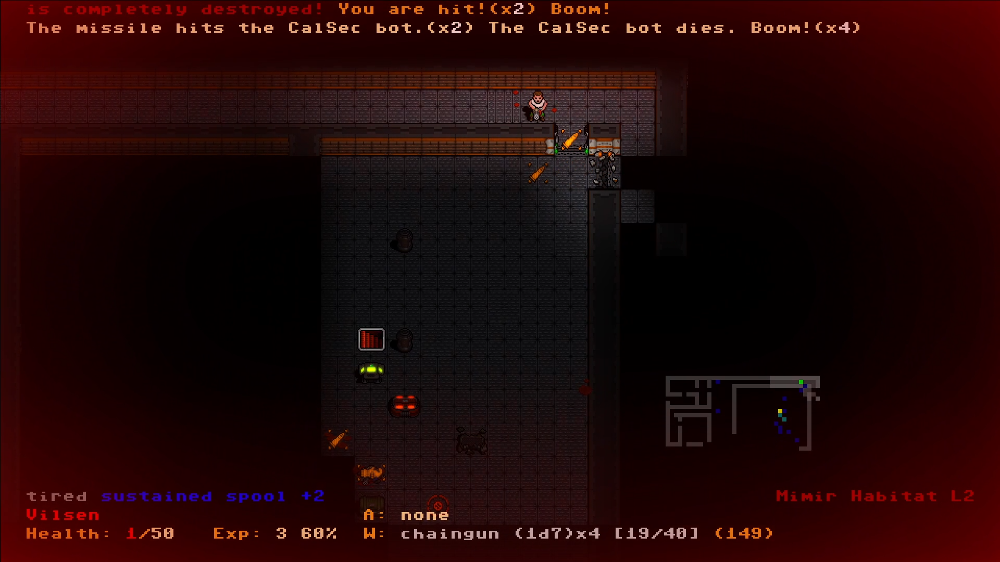

My armor’s completely fucked. Good thing I had a spare.

Alright you fuckers, now I’m pissed. No mercy.

More bots. Barely survive again. Why the hell am I fighting nothing but robots? My own base has never been this hostile.

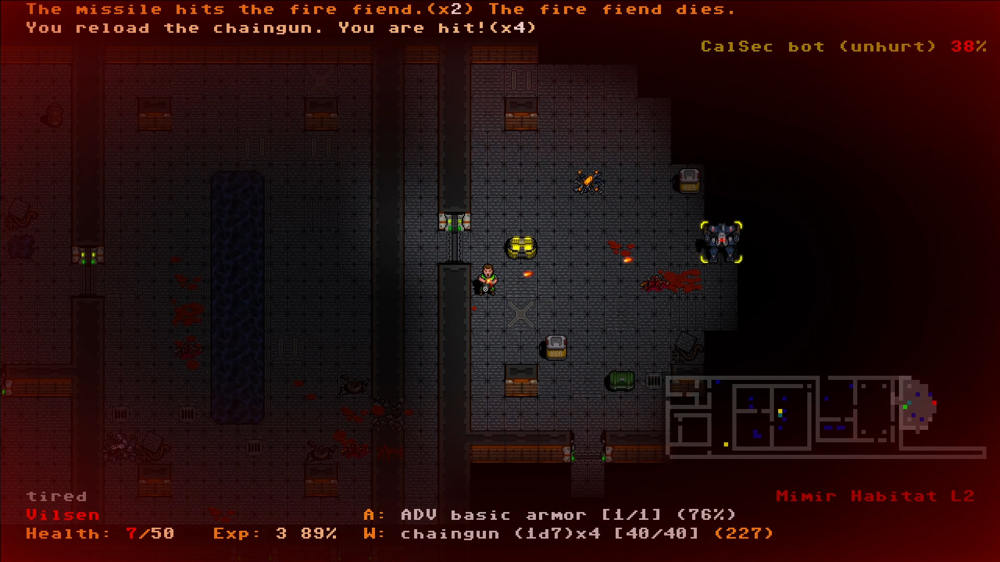

All this fighting isn’t for nothing though. I’m getting better at just standing still and spraying lead.

I head down to the Mimir Arena. Big round room with columns and tons of doors. This is where they’re waiting for me. Come on out, you sons of bitches!

First, Fiends teleport straight out of hell. I gun them down with the machine gun.

More flying skulls. Lots of them. I miss a lot, the little shits are quick. It hurts, but no time to whine.

I burn my last medkit. No more safety net.

Good timing too, because right after them comes a whole pack of Reavers. Not a single one of those ugly bastards reaches me.

My shooting must’ve punched through the walls and hit some acid barrels. The room starts flooding with acid. Time to get the fuck out.

I grab some mod packs and an ADV double shotgun. Two barrels — two corpses.

I slap the mod packs onto my machine gun and turn it into a fucking gatling gun. Now I’ve got enough belt ammo to kill everything in this shithole.

### Callisto 5 & 6

Back to familiar territory — corridors and rooms. At least here they can’t swarm me from every fucking direction.

I blast into the darkness with the double shotgun. The screams of pain immediately tell me if I hit something. Nice thing about shooting around corners — buckshot always finds the meat.

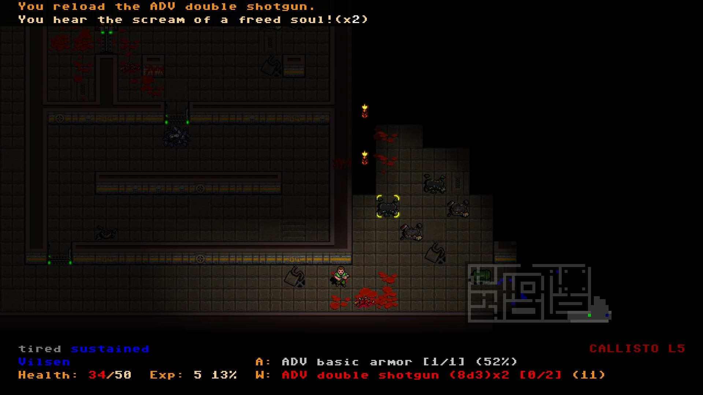

Those CalSec bots taught me how to shoot more accurately. The machine gun was spraying bullets all over the place, too many misses.

Although the machine gun is still too heavy for me, and enemies drop fast. The double shotgun can take out five Fiends in one go.

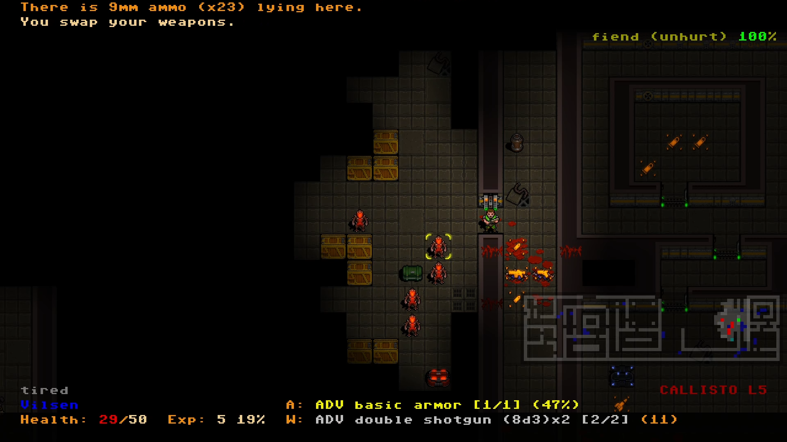

I go deeper. The station is heavily damaged here. Some rooms are flooded with acid, and half the floor is covered in water.

And here’s the reason for all the destruction — Former Inmates. These bastards are packed with explosives and more than happy to blow themselves up just to hurt me.

I see the TNT is about to go off, so I either shoot them in the legs to stop them reaching me or just back off and wait for the fireworks.

I also pick up some tactical boots. Now I can move faster. Should help avoid extra damage when the hordes come charging.

And here’s the local boss. A fat fuck with a rocket launcher for an arm. The idiot misses me at first, then lands two solid hits.

Hurts like a motherfucker. Still, I pump the fat bastard full of lead.

### Callisto Spaceport

I reached the Spaceport. There are some supplies here for marines heading out on missions. Even an elite red armor. I’ve always wanted one, but it was above my pay grade. Now nobody’s left to complain.

I walk past a storage area full of crates and — fuck me — an ambush. Medusalings and a Reaver burst out from behind the boxes. Adrenaline kicks in and the bastards drop.

That fight taught me to be more careful with ammo. Now I can use only half of what I’m actually shooting.

Near the shuttle there are more drones and robots. They were supposed to help with cargo. Who the hell thought it was a good idea to give them guns?

And here’s their boss. The Warden. That cocksucker is shooting with machine guns and a grenade launcher. The last bastard standing between me and getting the hell off this planet.

I slam a stimpack, adrenaline surges, and the Warden drops before he even realizes what kind of meat grinder he walked into.

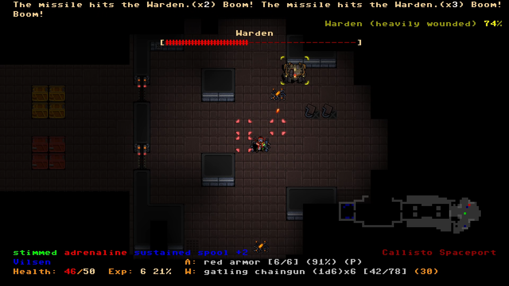

I board the dropship. There’s only one preset course — to the laboratories on Europa’s moon.

Fuck it. Might as well go and find out what the hell they’ve really been doing here.

I launch, and let the computer take me to Europa.

### Europa L1 & L2 & L3

Outside it’s fucking freezing. The whole base is iced over. Everything’s covered in ice so cold you can’t even stand on it. Touch it with bare skin and you’ll stick for good.

The demons made it here too. All that’s left of the people are zombies. Well, I’m used to putting them down. No pity whatsoever.

I’m starting to run low on machine gun ammo. Been shooting the thing way too much.

Great. Now the skulls are icy too. Glacimedalings everywhere, breathing cold. Get too close and they’ll freeze your ass.

Even the demons adapted. Ice Fiends now shoot ice. The bastards learn fast.

The robots here are nastier too. Security bots with machine guns also treat me as an enemy. Guess there’s no one left alive on the base. Our own bastards finished everyone off.

Ice Reavers don’t even need to get close anymore. They learned to shoot ice. Still tries to charge me though, the horned fuck.

I can’t fly back — the fucking computer doesn’t understand what I need. Guess I have to push deeper into the base.

The sergeants here are more fucked up. They don’t even rot because of the cold. Just strips of skin and meat hanging off them.

The whole base is flooded with acid. Can’t go further unless I want my feet to melt off. Fine, you fuckers can stay there.

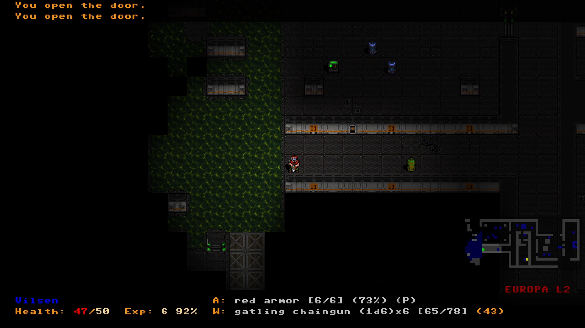

While gunning down robots I realize I’ve become the biggest son of a bitch in the world. My bullets always do the most damage.

One burst from the machine gun and the Ice Reaver drops. Like that. Fuck you.

The scientists cooked up some experimental drug that gives invulnerability. I slam it into my vein and feel like liquid lead is flowing through me. My skin turns to steel.

I’ve got nothing left to fear.

Then a flying eye with tentacles appears. A Glacimeda. Any second now skulls are gonna fly out of it. Tries to bite me, but good luck with that.

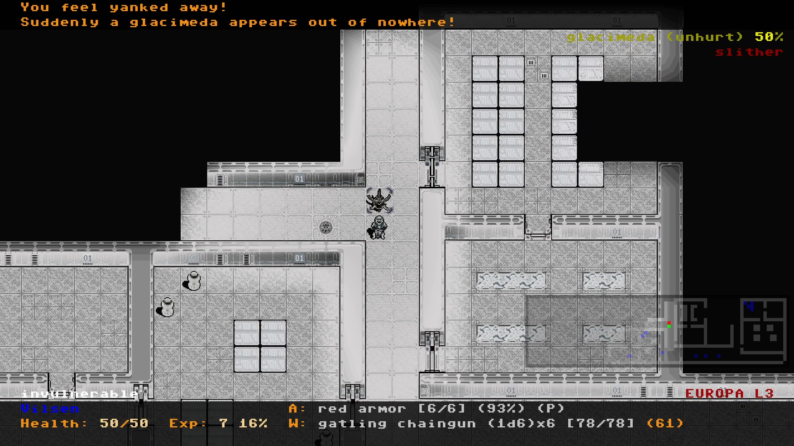

Its teeth can’t even pierce my skin. I gun the bastard down, and skulls fly out of its corpse. They try to freeze me, but cold doesn’t do shit to me anymore.

Another Glacimeda appears. This one hits me with a cold beam. Didn’t know they could do that.

And along with it comes another fat fuck — an Armored Ravager with dual machine guns and a mask on his ugly mug. Thought that would save him.

I empty into his fat gut and the bastard drops dead.

I head down to the Asterius Habitat. Let’s see what the fuck lives in there.

### Asterius habitat L1 & L2 & Asterius Breach

Just another regular base. I’m a bit disappointed, honestly. I had imagined all kinds of shit. At least there are plenty of robots.

Shooting these pricks has made me even more accurate.

Enemies keep coming from all sides. I just stand my ground and mow them down. Feels almost like I’m behind a stationary machine gun.

I pick up a couple power mod packs and slap them onto my double shotgun. Now I’ve got an elephant gun. Way more damage, though it takes longer to reload.

I descend into the Asterius Breach.

Finally something interesting. Besides the frozen assholes in the middle, there’s a huge fucking lake of blood. We dug really deep.

A bridge runs across the middle of the lake, and on it I find schematics for a tactical rocket launcher.

I don’t like rockets. Give me bullets any day.

I see a pentagram on the floor. A deal with the devil himself.

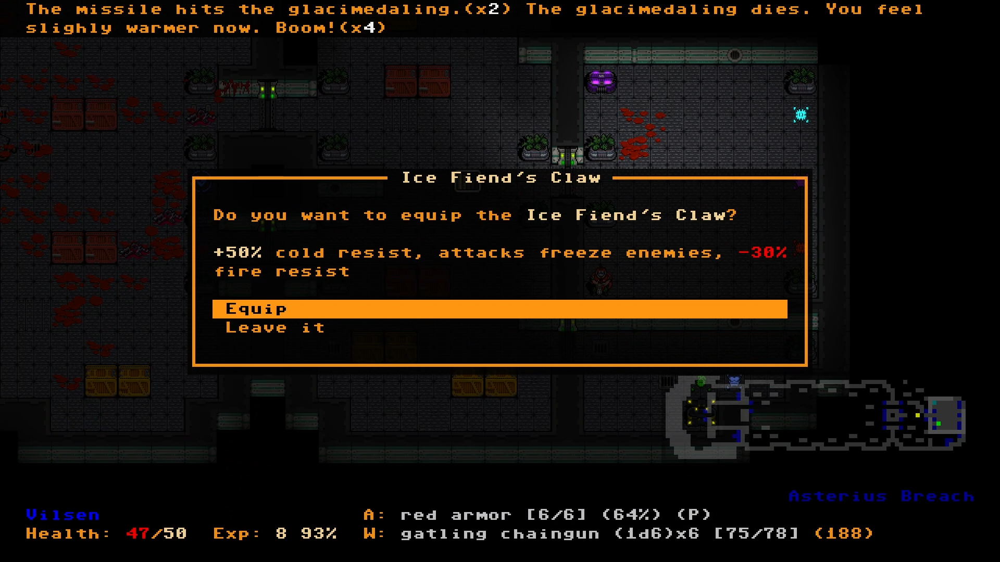

Trade your warm blood for cold resistance. All the demons on this planet made that deal.

I’m not one of those cowards. I don’t need that shit.

Before going down I grab a SuperCharge. All my wounds close up, scars disappear. I’m ready for war.

### Europa L6

Perfect timing. A squad of Ice Fiends and an Ice Reaver. I cut them down two at a time with the machine gun.

Now I’m even more careful with ammo. I can fire whole bursts with basically one bullet.

I only need to reload once per floor now.

Oh yeah, and my armor got even stronger. Nanobots repair it the second a hole appears. It’s heavy as fuck, but I don’t need to run around much anymore.

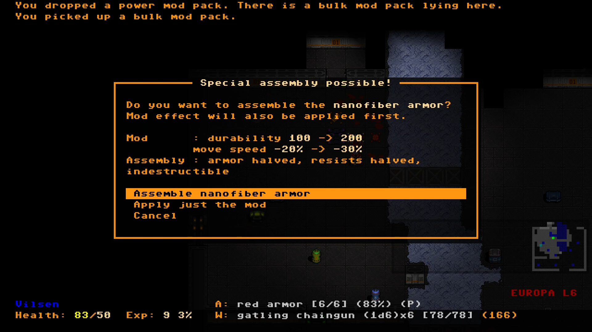

I’m basically a tank now. Just come and try me.

### Europa Central Dig

I arrive at the Central Dig. Let’s see what the hell they dug up here. It’s fucking freezing.

And here he is — the local boss. Made entirely of ice, horned and with wings. Time to shoot this bird down.

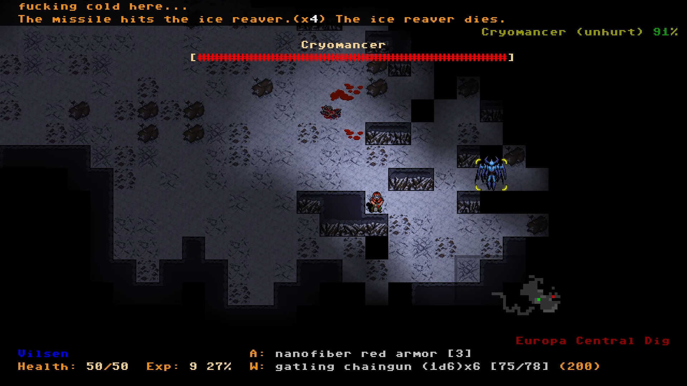

The fucker tries to freeze me. Ice bursts from the ground and sticks to my body.

But he can’t last long against the machine gun. The piece of shit falls straight back to hell.

In the middle of a small blood lake I see a portal. No idea where it’ll take me. But it’s definitely time to get the fuck off this planet.

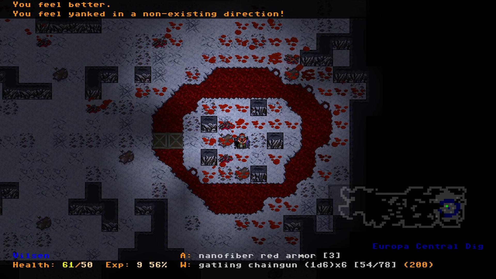

### Io L1 & L2

The cold was replaced by burning heat. The portal dropped me right next to streams of lava. So this is Io.

I always suspected Io wasn’t really abandoned. Never thought I’d actually visit it. And definitely not like this.

The demons here have adapted to the fire. First thing I meet is a Fire Fiend, an Archreaver, and of course a robot. Even here they couldn’t protect the base.

The skulls were already fiery on Callisto, so they couldn’t get any hotter.

These bastards hit with poison. My skin itches just from their stare, like I can already feel that shit eating into my flesh.

And of course there’s the Toxic Medusa. Someone has to keep spitting out Toximedalings.

While I was aiming at its eye I got even more accurate. Bullet spread should be minimal now.

I go deeper and run into a Toxic Reaver. There’s no saving me from that fucking poison. Veins on my arms turn purple, but I’m still alive.

I see a passage into the mines. Time to trade these base walls for something more interesting.

### Mephetic Mines L1 & L2

Oh yeah, hot ground and dirt walls — feels like standing in the middle of a giant furnace.

Not long ago this mine was full of activity: water dripping, conveyors humming, people shouting over the roar of drills. Now there’s only demons.

There are almost no enemies — I can barely even shoot anything. But there’s tons of supplies: crates stacked high, belts of ammo, canisters of who knows what.

Take whatever you want. But it only makes me more uneasy. Feels like someone left all this shit here on purpose to lure me deeper.

Now I’m a Hellrunner. I move through the depths of hell like a train on legs. I can even dodge despite all this heavy gear.

And here he is — the Warlock. A horned bastard with wings and no ribs on his chest. You can see his black heart beating.

The fucker can raise his own back from the dead. Reavers I just gunned down get up and come at me again.

Two bursts from the machine gun and I put the whole crowd back to sleep for good.

From the mines there’s a passage to the Noxious Hollow. I head down there.

### Noxious Hollow

This is a place of toxic fumes and strange creatures. It’s pitch black here. Hard to tell where the fuck I’m going.

I’m not even sure if I’m walking in circles.

All around me there’s just hot ground, dirt, acid, and poisonous bastards.

Two Toxic Medusas greet me right away. Poison flows through my veins. I need to get the hell out of here fast.

The fights here taught me how to squeeze even more damage out of my machine gun. I’m getting the absolute maximum now.

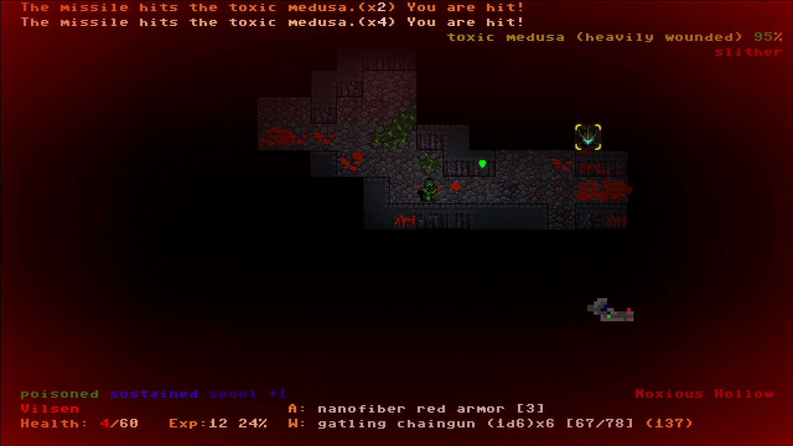

While looking for the exit I almost die to a Toxic Medusa. I burn through medkits one after another. Starting to get scared.

Around the corner two more Toxic Medusas are waiting. I survive by the skin of my teeth again.

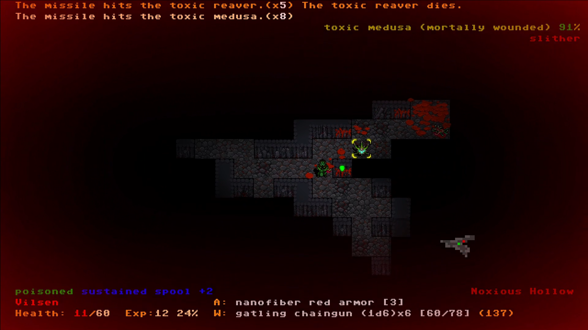

The place is turning into a slaughterhouse. Blood and demon corpses everywhere. I can only navigate by these trails.

There it is — the long-awaited exit. Time to get back to the base.

### Io L5 & L6

The darkness from Noxious Hollow still won’t let me go. I can barely see anything even on the base now.

A crowd of robots nearly turned me into Swiss cheese. I survive by pure luck. After that fight I became even more of an Ironman.

### Gateway

This is what they call the Gateway. Let’s see where the fuck it leads.

After going down I see a structure that looks nothing like the rest of the base. This wasn’t built by humans. This is a demon base.

Floors and walls are gray stone. Everything covered in runes. The only question is what’s waiting for me behind the door.

I show myself to the enemy and immediately pull back. Let them come out one by one.

I gun down a Toxic Fiend, but before my machine gun even cools he gets back up. Means there’s a Warlock here.

And not just one. Another Warlock flies out of a river of lava. I deal with him first before he can raise anyone.

Every attack from these bastards only makes me stronger. I keep fighting until all my bones are broken and I have no blood left.

Inside there are two more Warlocks. I focus on them first.

While I’m busy with the demons that have become easy targets for me, their leader finally shows up. The Archwarlock. The bastard nearly roasted me alive.

Poison seeps into all my organs. I need to heal fast.

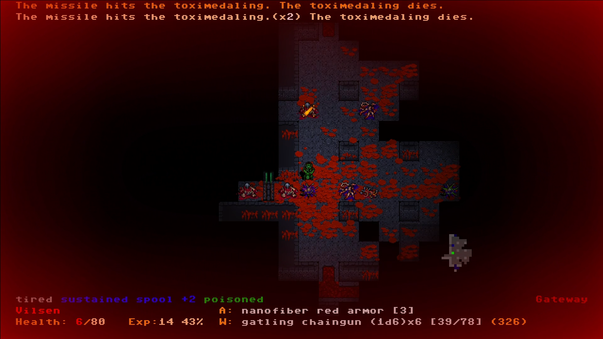

I spent over an hour gunning down demons just to get inside.

And here’s the boss of this base. An Ancient with a shield and sword. Shoots plasma.

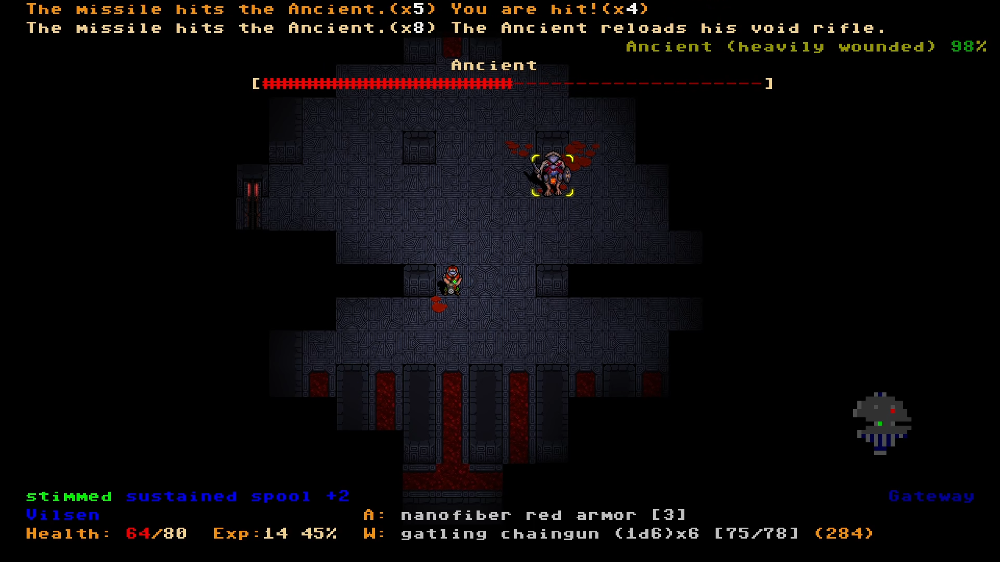

When he looked like he was about to die, the fucker still had one last surprise.

The bastard created illusions. No idea which one is real. They all hit like the original. My machine gun sucks for shooting in every direction.

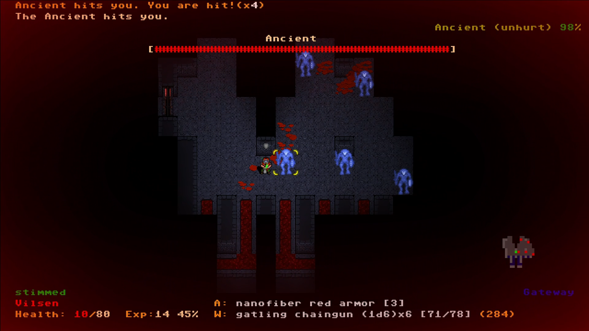

I burn one medkit. Only two left.

I spray bursts at the illusions until one of them lets out a death scream. Got you, you fuck.

The Ancient collapses to the ground. An eerie silence returns.

He was guarding the portal further in. Time to invade the demons’ own territory.

### Dante Vestibule

I get yanked into some non-existent direction. When the vertigo finally passes, everything feels much heavier.

This looks nothing like what I’ve seen before. Strange drawings on the walls and floor. Everything made of stone.

I don’t know where the hell I am. Or how I got here. But this sure as shit ain’t Io anymore.

The first unlucky bastard is a Warlock. He doesn’t even get to scream. Every step brings new enemies. Looks like they’ve made themselves right at home here.

The tension is rising. I’ve almost got nothing left to heal with. Can’t afford to take hits. Good thing there’s no poison at least.

These fights have hardened my skin. I’m tough as nails now.

I didn’t get to enjoy the lack of poison for long. Looks like they’ve gathered every kind of enemy from all the planets. Gotta be ready for anything.

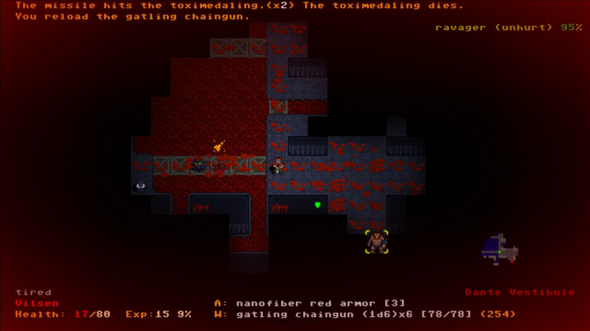

Covered in wounds, I keep pushing forward. Only two medkits left. I’m taking risks, but I’m not using them yet.

### Dante L2 & L3

The door opens — and I just quietly curse under my breath.

The corridor is packed with monsters. One, another, a fifth… there’s a whole fucking crowd of them.

In the middle stands a massive ugly bastard, surrounded by smaller shit.

I’ve got enough ammo.

Health, on the other hand… not so much.

Now this is the real hell.

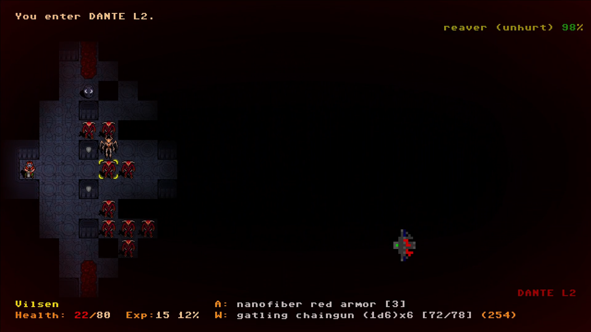

My heart is pounding like it’s trying to break out of my chest. The world speeds up, and my hands grip the machine gun tighter.

I unload a long burst straight into the big fucker.

The Warlock drops.

But it doesn’t get any easier.

While I’m mowing down Reavers, another one comes out from the back of the corridor. Same type. He was hiding behind the horned bastards, waiting until I couldn’t reach him.

What a sneaky cunt.

If I don’t take him out fast, everything I just killed is going to get back up.

I heal quickly. One medkit left. And while I’m patching myself up, a Ravager gets back on its feet.

Time to end this shit.

After finishing off the demons, I check what they left in the crates. And I find the best invention our scientists ever made — the Minigun.

More powerful than my gatling chaingun, longer belt, faster reload.

Goodbye, gatling chaingun. You served me well through hundreds of demons. But I won’t take you into the final fight.

Before going down I grab an invulnerability powerup. Like it was waiting for me.

The demons’ resources must be running low. Otherwise I can’t explain why the next level only has a few bastards waiting for me.

Or maybe they saved the worst for last.

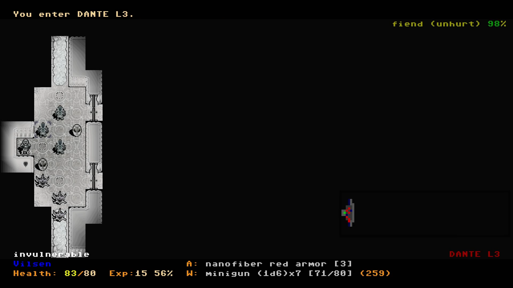

Perfect time to test the new gun.

I pull the trigger.

The Minigun doesn’t even shoot — it just erases everything in front of me.

### Dante Altar

So here I am, right in the heart of their fucking lair.

There’s a long bridge in front of me. The moment I walk across it, it collapses behind me.

No way back.

Alright then.

Come out, you big bastard.

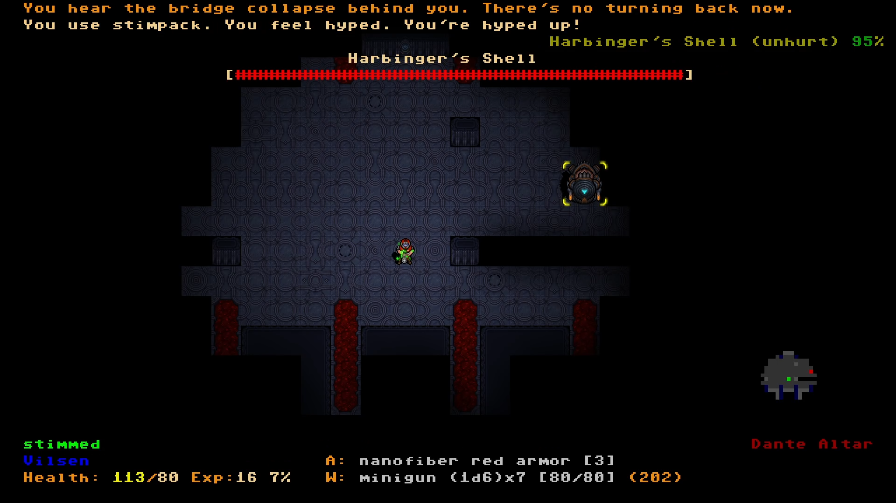

The cunt’s hiding in a shell.

Doesn’t matter.

I’ll shoot straight through it.

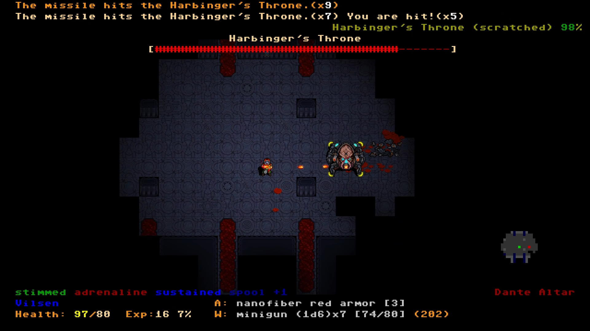

There he is.

What an ugly fucking face.

Looks like a giant tick someone forgot to crush.

I’ll fix that.

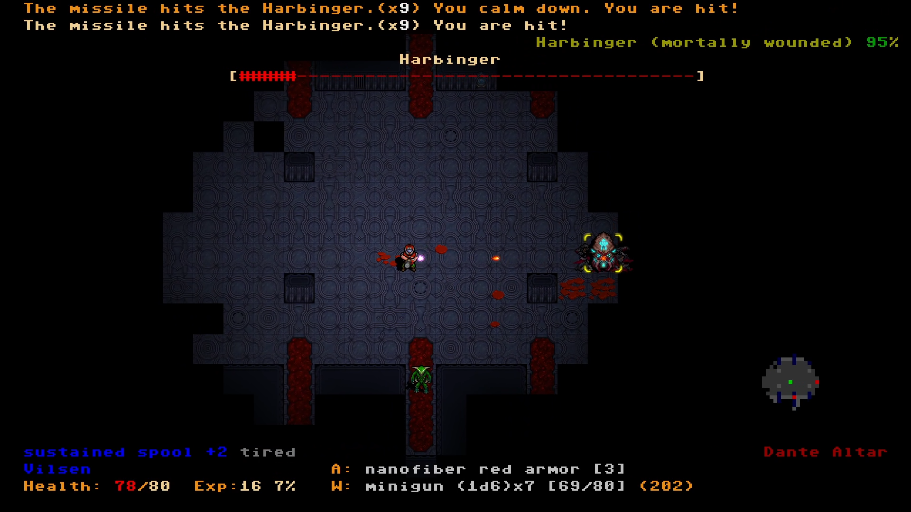

The shell explodes.

Then the legs.

Now the bastard’s got nowhere to run.

I finish the piece of shit off.

Once I beat the Harbinger and clean out Dante Station, I’m supposed to win, right?

Where’s my fat reward and ticket home? It’s not supposed to end like this!

...

...

Connection lost.