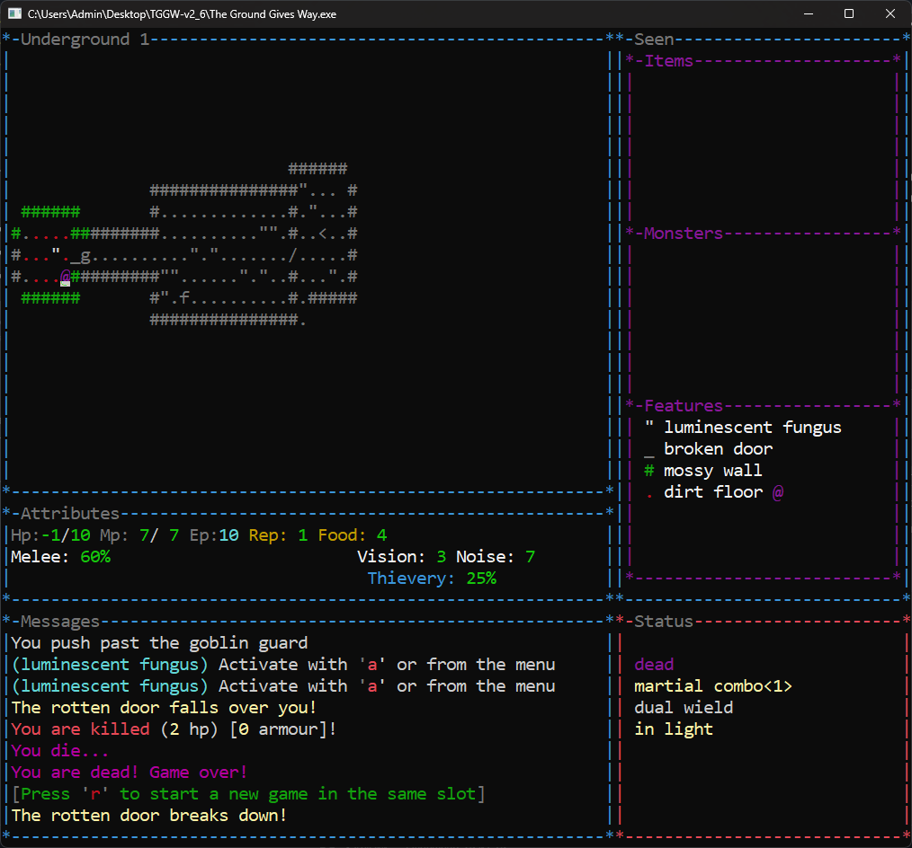

## Quick Overview

The game has a small community, but the people who play it seem to love it.

Judging by the description, this isn't supposed to be a huge roguelike. Some players even call it a coffee-break roguelike.

We'll see about that.

My bet is that the game is a lot harder than it looks and that clearing it quickly won't be an option. There will be walls to bang my head against and hopefully a few memorable "wow" moments along the way.

## First Death

I'm not sure if this counts or not, but my very first death happened in the tutorial.

In the lesson called "The Dungeon," right after getting through the traps, I ran into two wild dogs at once. My only item was a torch, which turned out to be less helpful in combat than I had hoped.

The dogs won.

My first *real* death happened on the third floor of the dungeon.

After clearing the level, there was still one unopened door left. The game specifically asked whether I was sure I wanted to open it.

There didn't seem to be any reason not to. I hadn't noticed any warnings. Maybe my character was concerned about the noise coming from the other side.

You could definitely hear that somebody was in there.

Turns out it was a party.

The first guest to come say hello was a shock bolt.

Then a zombie.

Then another zombie.

Then an acid blob, which immediately started working on my armor.

And then another zombie.

Somewhere in the back I could also see a mummy waiting for her turn, but she never got the chance.

I died first.

## What I Learned After the First Hour

What's interesting is that the game doesn't seem to have that many mechanics, but it does have a lot of items.

Burn an enemy, and you're left with a pile of embers. Eat a banana and you get a banana peel.

The game starts you with absolutely nothing. No weapon, no fancy equipment.

Just your fists.

Good luck.

The levels aren't empty either. There are bushes, patches of vegetation, ponds, lava pools, poisonous pools, and all kinds of terrain features.

It's a long way from the classic formula of rectangular rooms connected by corridors.

The game promises a steep difficulty curve as you descend deeper into the dungeon.

That creates an interesting dilemma.

On one hand, you want to explore every floor as thoroughly as possible to find more items.

On the other hand, there's no experience system and no character progression.

Which means killing monsters isn't automatically worth the risk.

## What I Learned After the First Five Hours

So far I'm struggling to get through the Underground.

At first, I played the way I usually do in roguelikes: clear every floor, kill everything that moves, and collect as many items as possible.

Apparently that's not the right approach here.

The advice I keep seeing is to avoid fights whenever possible and to keep your health above +5. I wasn't doing either of those things. In most roguelikes, enemies aren't dangerous enough for that level of caution.

Here, they might be.

Most of the loot I find is junk. Very little of it actually helps in combat. What I really want is some kind of build. Any build.

I don't care what it is, as long as the items work together.

So far everything feels completely random.

For now, I'm going to try a different strategy: stop hoarding food, keep my health higher, and descend faster in search of better equipment.

We'll see how that goes.

I died immediately after writing those notes.

On the very next floor.

Crushed by a door that I was trying to use to lock out a goblin.

## What I Learned After Fifteen Hours

A certain amount of despair has started to set in.

My death counter is approaching one hundred.

I've only reached the Laboratory three times, and even then I only made it to depths 3 or 4 before something killed me.

The strange thing is that the game doesn't seem mechanically overwhelming.

There aren't that many systems on the surface.

Yet somehow I'm clearly missing something.

To be fair, I'm not using all the tools the game gives me.

I keep trying to play as a straightforward fighter. My mana is almost always at zero, and sometimes it's negative.

As a result, wands mostly pass me by.

I don't donate money to the guild either, so my reputation isn't exactly impressive. That means mechanisms are largely unavailable to me as well.

And I don't steal.

I've experimented with it a couple of times, but I still haven't figured out how important it really is.

At one point I robbed a castle.

It went badly.

Still, it seemed worth trying if only to find out what would happen.

The answer, as it turns out, is "nothing good."

I reach the Dungeon in about half of my runs.

Treasure vaults, on the other hand, I usually leave alone. Surviving is hard enough already.

I did open one once.

Inside was a Troll with 24 health.

And my immediate thought was:

How exactly am I supposed to kill that?

The game always promised to be difficult.

Oddly enough, what keeps me going is the record win streak.

If somebody managed to achieve a streak that large, then the game must be beatable.

As for useful discoveries, I've finally figured out how save scumming works here.

Not that I actually use it.

The runs are short. Half of them last less than ten minutes anyway.

It's usually faster to start over and hope the dungeon decides to be a little more generous next time.

## Deeper mechanics

Had a pretty funny run today.

I joined the Healer Guild, which is strongly against killing. For about six floors I fought everything bare-handed and just knocked enemies unconscious instead of finishing them off.

Then I finally found a weapon.

My immediate thought was: "Well, no point letting them wake up later."

So I went back and executed pretty much everyone I'd left behind.

My reputation instantly dropped to -21.

"Whatever," I thought. "I wasn't planning to use the guild anyway."

On the very next floor I found a sign informing me that I was now wanted by the Healer Guild for my crimes.

"That's actually kind of cool," I thought.

One room later, an assassin squad jumped me and stacked 94 poison on me.

Somehow I survived thanks to sleep.

Then on the floor below I killed a zombie and a mummy, which apparently improved my reputation back to -19.

The assassins immediately stopped coming after me.

So apparently murdering undead is fine, but knocking out bandits and coming back later to execute them is where the Healer Guild draws the line.

## To the Artifact and Back Again (Story of a Single Run)

### The Only Reload

I’ll admit upfront: this didn’t go through on the first try. One reload.
I didn’t expect the ascent to be this unforgiving. Got turned around on the stair layout and wandered straight into a Castle.
Even with *spoilers* on my heels, I pushed toward the portal anyway. Turns out it was deactivated. No path back.
That was the only reload. The rest was clean.

### Underground 1

When I was a child, listening to stories about legendary artifacts and the adventurers who hunted them, I always dreamed of becoming one of them.

I grew up on tales told around campfires. I didn't want to listen to those stories—I wanted to bring one back myself. Something heavy. Something ancient. Something with a history of its own. The kind of treasure that makes people stop talking when you put it on the table.

Eventually I learned that there was a vast dungeon somewhere in the neighboring forest. Nobody had ever reached the bottom. People spoke of walls made of pure gold, endless treasures, and wonders no one had ever seen before.

That was enough for me.

I left my pack at the edge of the woods and continued with only the essentials. If I found the entrance, I could always come back for the rest. If not, at least I wouldn't wear out my boots searching.

Then one day, during one of those searches, the ground opened beneath my feet.

I crashed down into darkness and landed hard on damp soil. When I got up, I found myself in a chamber with mossy walls.

A wooden door stood nearby, which meant this definitely wasn't some animal trap.

This was it.

The dungeon I had been looking for.

I had nothing with me except my fists. I could have tried climbing back out, but curiosity won. There were no skeletons lying around, no signs that other adventurers had met terrible fates down here.

So I decided to keep going.

If I was lucky, I'd find something useful before whatever dangers lurked below found me first.

The air was cold and damp. Naturally, the first thing I did was open the door.

The room beyond was brighter. Long grass covered the floor, and clusters of luminescent fungus cast a pale glow across the stone.

After searching around, I found a rod.

I had some talent for magic, but I had never seen a rod like this before and had no idea how to use it.

There was another passage leading onward, and curiosity got the better of me again.

Beyond it was a circular chamber with a small room built in the center. It immediately looked like the sort of place where something valuable would be stored, safe from the moisture dripping from the ceiling.

I was right.

Sitting on a shelf was a hand axe.

It was in excellent condition. The kind of tool that would fetch a respectable price back home. Someone had clearly taken good care of it.

I doubted anyone would mind if I borrowed it.

Axes are best used where there's room to swing them, and from what I'd seen so far, this dungeon had plenty of space.

The next room contained a massive block of ice.

Strangely, it hadn't melted despite the relatively mild temperature underground. Its smooth surfaces made it obvious that it was man-made.

The ice was opaque, though. I couldn't see what was trapped inside.

Perhaps some powerful mage had frozen a dangerous monster. Or perhaps it was a treasure someone desperately wanted to hide.

There was only one way to find out.

I hacked away at it with my axe.

In the end, there was nothing inside.

All I managed to uncover was an ice crystal.

Well, no reason to waste it. Into my pack it went.

The block collapsed into a mound of snow that immediately began to melt.

Further ahead I spotted a massive shield.

A tower shield.

The moment I picked it up, my arm started aching from the weight. It became immediately obvious that if I carried this thing, my magical ambitions were over.

On the other hand, I didn't own a single wand.

I wasn't giving up much.

The shield scraped against the stone floor as I walked, leaving scratches behind. The corridor no longer felt quiet.

Sneaking was out of the question now.

If trouble came, I'd have to face it head-on.

So be it.

I'd be a warrior.

Further on I encountered a wild dog.

Something about its cheerful barking told me it was a good boy and unlikely to cause any trouble.

I was right.

Unfortunately, I had no food to share with him. The dog seemed happy enough to see me, but had no intention of following me.

Apparently life in the dungeon suited him just fine.

In the next chamber I noticed that the floor had partially collapsed.

Several depressions dotted the ground. At the bottom of one of them I spotted a bottle.

I recognized it immediately.

Wine.

Back in my village, drinking alcohol was considered a sin. Still, I decided to take it with me.

Perhaps nobody would be watching down here.

And perhaps I'd finally find out what all the fuss was about.

Nearby lay a dagger.

A weapon for thieves. For people who hide in shadows and strike when nobody is looking.

Not my style.

Besides, carrying a giant shield and a tiny dagger at the same time would look ridiculous.

I took it anyway.

You never know.

From the next room came the sound of movement.

Something was definitely in there.

I could have avoided it. Walked away and continued exploring.

But I had decent equipment now, and I felt confident enough to investigate.

As if trying to warn me off, there was another door immediately behind the first.

Still, I was determined to see what was waiting on the other side.

Behind the two doors was another wild dog.

This one had either gone feral or simply hadn't eaten in a very long time. It made its intentions clear the moment it saw me.

I'd rather not go into detail about what happened next.

I'm not particularly proud of it.

In the middle of the room stood a fountain radiating magical energy.

A shame it wasn't much use to me. I'd practically abandoned magic the moment I picked up the shield.

Small bushes grew nearby, so I decided to search them for anything useful.

To my surprise, one of them was growing bananas.

Only one was ripe. The others were tiny and green.

I took the ripe one.

A little further on, a rat was waiting for me in the next passage.

That encounter was considerably less dramatic.

The room beyond contained two rotten apples and a handful of coins.

Even the rat hadn't been desperate enough to eat those apples.

I took them anyway.

There were also two sacks.

Inside one, I found a zircon. Assuming I survived long enough to leave this place, I could probably sell it for a decent amount.

Nearby was a pile of stones.

Not large stones, but certainly large enough to hurt if thrown.

I armed myself with a few, though with both hands already occupied I doubted I'd be able to throw them very far.

Buried among the rocks was a seed.

I had no intention of taking up gardening underground, and I had no idea how long it would take for anything to grow.

The seed could stay where it was.

At last the corridor came to an end.

A spiral staircase descended into darkness.

The air grew colder.

I adjusted the shield on my back and took my first step downward.

### Underground 2

Descending the staircase, I found more of the same damp earth and mossy walls.

I was immediately attacked by a giant moth. I'd never seen a moth that large before. It was hard to believe the thing could even fly considering its size.

Nearby lay a badly dented helmet. Whatever had happened to it, the dungeon had finished the job. The metal was so worn that it practically crumbled in my hands.

While digging through a pile of garbage, I cut myself on a piece of glass.

Naturally, a rat immediately attacked me. Apparently it considered the trash heap its personal property.

There was also a large barrel of water nearby.

Refreshing.

Just being around it seemed to fill me with energy.

Beyond it I encountered undead for the first time.

An animated hand came crawling toward me on its own. I saw no body attached to it. The Healer Guild respects those who deal with undead, so I couldn't simply ignore it.

Besides, the thing moved surprisingly fast. Running away probably wasn't an option anyway.

Clutched in its fingers was a potion.

A little further on I found an unfamiliar scroll and a few coins. I stopped to examine the scroll more carefully.

The letters seemed to drift across the page. The text twisted into a spiral, written in deep violet ink.

It didn't take long to identify it.

A Scroll of Chaos.

There was absolutely no way of knowing what would happen if I read it.

That sounded dangerous.

I decided to leave it where it was and save that particular gamble for a desperate situation.

Not everything I found was useful.

There were stones too large to throw, even with all my strength behind them.

There was also a broken wand.

No great loss. Magic was never really my path.

One chamber contained a large pool of deep water surrounding several rusty statues.

Among them wandered another wild dog.

The dog sniffed me, found nothing interesting, and trotted away.

A shame he wasn't interested in my rotten apples. I would have gladly shared them.

Further on I entered a room filled with garbage and worms of every kind.

Shadow worms.

Ice worms.

White worms.

They had clearly found plenty to eat down here, so I wasn't expecting to discover anything valuable among the mess.

Turns out I was wrong.

Growing among the bushes were a banana, a silverleaf, and an aloe leaf.

While searching through the debris, I managed to cut myself again.

I really needed to be more careful.

For a moment I regretted not bringing gloves with me, but it was far too late to go back now.

Hopefully I wouldn't have to dig through any more trash.

Eventually I decided to examine the potion I'd taken from the animated hand.

It turned out to be a Potion of Balance.

I'd never used one before, but I knew what it did. Fast creatures become slower, while slowed creatures regain their speed.

I had no reason to slow myself down, but it seemed like exactly the sort of thing I'd want to drink if I ever found myself moving sluggishly.

Only now, while telling this story, do I realize I could have coated my weapon with it and used it against fast enemies.

A useful lesson for future adventures.

At last, I found a loaf of bread.

I wasn't particularly hungry yet, so I saved it for later.

There would be time to eat.

For now, it was time to go deeper.

### Underground 3

Opening the next door, I was nearly blinded by a bright orange glow.

A real campfire.

I hurried over to it, grateful for the chance to rest, dry my clothes, and catch my breath. I had nothing to feed the fire with, so I quickly decided to make use of it while I could.

The only thing I had worth cooking were the bananas.

Roasted over the flames, they were far more filling than raw ones.

I also ate my loaf of bread before it had the chance to grow any more mold.

Nearby I found a pair of knitted mittens.

They wouldn't help much in a fight, but my hands immediately felt warmer. Thick wool, rough stitching, surprisingly comfortable.

After dealing with the giant moth, I found a small vial filled with green liquid.

After a moment of thought, I recognized it as a lesser healing potion.

Useful stuff. The kind of thing that closes wounds almost instantly when a fight starts going badly.

There were also a couple more barrels of water.

And yes, I drank both of them.

I had every right to.

I'd just eaten dry bread and roasted bananas.

A little extra water wasn't going to hurt.

Sitting beside the fire, warm, fed, and no longer thirsty, I relaxed more than I should have.

For a while I didn't even feel like moving.

But adventure has a way of making people leave comfortable places.

After an easy fight with a vulture, I came across something unusual.

A wall of clean-cut stone.

This time there was no moss covering it.

The stone had been carefully shaped and maintained. Someone had once cared about this place.

This wasn't just another room.

This was something important.

My instincts told me there was probably something valuable hidden beyond it.

My instincts also told me that valuable things tend to have guards.

The question was whether I was ready to fight for a reward I knew nothing about, or whether caution would serve me better.

Before I could make up my mind, something caught my eye.

There was a trap built directly into the stone door.

Someone had gone to considerable effort to make sure visitors stayed out.

That settled the matter rather quickly.

No sense looking for trouble.

Whatever was hidden behind that door could stay hidden for now.

I turned away and continued deeper into the dungeon.

### Underground 4

This level was nothing like the familiar dungeon of rooms and corridors.

This was a real cave.

Uneven ground, patches of mud, and clusters of luminescent fungus stretched into the darkness.

The inhabitants were different, too.

A black ant greeted me almost immediately at the bottom of the stairs.

I was more worried about what I couldn't see than the ant itself. Creatures like that rarely live alone. If it had a colony nearby, I wanted to be gone before its companions discovered that one of their own had just been split in half with an axe.

At last, I found a pair of boots.

Leather boots.

Nothing fancy, but they offered a little protection. My feet were already beginning to protest the endless walking. Besides, after seeing entire packs of worms crawling around, a bit of extra protection seemed wise.

It would have been nice to dry my feet before putting them on.

Still, they would do.

A little later I encountered another adventurer.

He appeared without warning. First the scrape of boots against stone, then the familiar posture of someone who keeps their hands close to their belt.

A cutpurse.

Not a monster. Just a man who had decided my belongings would serve him better than they served me.

I struck him twice.

Not hard, but hard enough to interrupt whatever calculations he was making.

He froze.

His hands lowered.

The aggression faded, replaced by cautious indifference.

For a moment we simply stood there.

I would have asked where he was headed.

He probably would have asked the same.

Unfortunately, our languages were different, and steel was the only one we both understood.

After the second blow, negotiations were over.

He nodded, stepped back into the shadows, and let me pass.

I continued on my way.

Neutrality is when both sides realize that continuing the fight would be a bad investment.

Still, was it really worth trying to rob me?

I had only eighty-one coins to my name, gemstones included.

Enough for a few meals.

Not much else.

Where was he planning to go with those injuries?

Then again, perhaps he saw my equipment and assumed I came from a wealthy family. A shield like mine certainly gave that impression.

If only he knew the truth.

It was obvious he hadn't been down here much longer than I had.

I found something he had somehow missed.

A Corrosion Ring.

I hadn't encountered any acid-based creatures yet, but I knew enough to recognize a valuable item when I saw one.

Remember this ring.

It turned out to be one of the most important items of the entire expedition.

In fact, I'm still wearing it today.

I also found a suit of leather armor.

Not exactly the sturdy plate I dreamed of, but at least blows to the chest would hurt a little less.

The problem was that I was exhausted.

What I really needed was rest.

The armor looked so tempting that I convinced myself a quick snack would solve the problem.

So I took a bite from one of the apples.

I won't describe what I discovered after that first bite.

Let's just say my stomach immediately informed me that this had been a terrible decision.

At least it gave me enough energy to put on the armor.

Really, I should have rested first and changed equipment afterward.

Because of the stomach pain, that rest stop ended up lasting twice as long as it normally would have.

Eventually my strength returned.

My wounds closed.

I felt ready to continue.

Something strange had happened while I rested.

The bottle of wine I'd been carrying had somehow become aged wine.

Apparently it only takes a few days to achieve that distinguished status.

The stuff now healed wounds almost as well as a medicinal balm.

I still wasn't convinced I wanted to find out what it tasted like.

Better to keep it for emergencies.

Just before descending to the next level, I ran into the cutpurse again.

This time, the moment he saw me, he made it very clear that he wanted no part of a fight.

Lesson learned.

### Underground 5

Whew. Back to proper rooms.

I felt safer immediately.

No need to worry about something creeping up behind me. One door. One corridor. One direction to go. No difficult choices, no listening for distant noises.

Just follow the path ahead.

That kind of adventuring I could appreciate.

Before long I found a Ring of Peace.

Not that it would do much to announce my intentions. Monsters rarely stop to admire jewelry before attacking.

Still, it offered a bit more protection.

As if the dungeon had taken that personally, a lightning beetle immediately came flying at me.

The creature attacked with electricity.

Painfully.

I had hoped that all my leather equipment might offer some protection.

It did not.

The fight nearly killed me.

I survived with only a sliver of strength remaining. One more strike and my adventure would have ended right there.

Perhaps charging into melee had been a mistake.

Maybe I should have thrown stones instead.

Another rest was required.

I needed time to recover and think about what exactly I was doing down here.

The next difficult encounter came soon after.

A scintillating toad.

A green snake.

A frost toad.

The deeper I descended, the more dangerous the creatures became. Each one seemed to have its own unpleasant trick.

You can't prepare for everything.

My thoughts became sluggish.

The world felt hazy around the edges.

I could barely think straight.

Whatever had afflicted me had left me confused, and continuing in that state seemed unwise.

I stopped to rest.

Unfortunately, another problem was beginning to demand attention.

My stomach growled.

I was completely out of food.

Resting was no longer an option.

I needed to find something to eat.

The next room contained a flooded section of floor.

Thankfully the water wasn't deep enough to swim through.

My boots still ended up soaked.

That worried me more than it should have.

After the lightning beetle, the idea of standing in water while being electrocuted again sounded like a very effective way to die.

Naturally, creatures that enjoyed damp places had already claimed the area.

A giant toad attacked me.

I had no idea what it had been eating to grow that large, but it seemed eager to add me to its diet.

While fighting it, I spotted something on the shoreline.

An amulet.

I almost missed it.

An Amulet of Health.

Even before putting it on, I could feel the magic radiating from it, strengthening my body.

That decision required no thought at all.

I slipped it around my neck immediately.

A few extra blows might not sound like much.

Down here, they could mean the difference between life and death.

Unfortunately, the amulet couldn't solve my hunger problem.

Still not food.

Then, at last, I found salvation.

Frozen meat.

It wasn't glamorous, but it was exactly what I needed.

For a moment I considered eating it as it was.

Common sense prevailed.

My stomach was already unhappy enough.

It would have to be cooked.

That meant turning around and heading back.

I hoped the campfires I'd passed earlier were still burning.

The first one wasn't much help.

As the meat thawed, droplets of water hissed into the flames and the fire quickly died.

The second campfire proved more cooperative.

Before long I had properly cooked meat and a full stomach.

Warm.

Fed.

Rested.

Ready to continue.

As if the dungeon wished to reward my persistence, I found a second Corrosion Ring nearby.

What incredible luck.

I had no idea yet just how important those rings would become.

Looking back, I'm not sure if I had survived the expedition without them.

### Dungeon 1

This staircase was different from the others.

No moss.

No damp earth creeping between the stones.

The steps were carved from solid rock, and that could only mean one thing.

I was leaving the Underground behind.

At last, I was entering the Dungeon.

A place built rather than formed.

A place where someone lived.

A place that was maintained.

No longer a refuge for beasts and wandering monsters, but the domain of something intelligent.

As if to confirm my suspicion, I was immediately confronted by an armored goblin.

Tall for his kind, clad in armor, spear at the ready.

He spotted me the moment I stepped from the stairs.

Almost as though he had been standing watch over the entrance.

A good sentry.

The sort that could easily deal with any animal foolish enough to wander down here by mistake.

Everything felt different.

In the caves, my path had been illuminated by patches of luminescent fungus.

Here, the light came from large braziers burning along the walls.

The shadows danced differently.

The air felt different.

The place itself felt different.

I had never been anywhere like this.

Back home, buildings were made from wood.

Here, the walls were stone, and some of them even featured arrowslits.

Whoever built this place expected trouble.

Perhaps from adventurers like me.

That realization was not particularly comforting.

For the first time since entering the dungeon, I felt genuinely nervous.

Whatever waited below would not be as simple as oversized insects and hungry animals.

I would need to be careful.

After dealing with a pair of blood leeches that failed to penetrate my armor, I encountered another goblin.

This one was a mage.

He attempted some sort of spell against me.

Unfortunately for him, casting magic becomes considerably more difficult when an axe is being swung in your direction.

So far, I had handled every variety of goblin without much trouble.

Spearmen.

Guards.

Mages.

None had managed to stop me.

Perhaps I was lucky.

Perhaps goblins were the primary inhabitants of this place.

If so, the Dungeon might prove less dangerous than I feared.

With that optimistic thought in mind, I continued downward.

### Dungeon 2

More undead.

This time, a skeleton.

I couldn't help but wonder who it had once been. An adventurer? One of the goblins?

The thought was unpleasant enough that I decided not to dwell on it.

The skeleton spotted me from a distance and immediately began throwing bones.

The fight was harder than I expected.

Unable to break through my armor, it focused on driving me back instead. Every strike seemed to shove me a step further.

Where was it getting so much strength?

Before long, I found myself pinned against a wall.

There was nowhere left to retreat.

The battle left me exhausted.

Afterward, I picked up one of its bones. I'd heard that such things could help against poison. Useful enough to keep.

Barely.

My pack was already overflowing.

For the first time, I had to seriously consider what to leave behind.

I couldn't carry every interesting object I stumbled across.

The apples were the obvious choice.

One bite had already taught me everything I needed to know about them.

There was no reason to keep carrying them.

A moment later, an arrow struck the wall beside me.

Someone had spotted me.

A scout.

The noise from my fight with the skeleton must have attracted attention.

I needed to close the distance quickly.

If I let him keep shooting, I wouldn't last long.

The moment I got close enough, the scout shouted at the top of his lungs.

Wonderful.

Exactly what I needed.

Reinforcements.

I rushed after him before anyone else could arrive.

The scout turned and ran.

At the end of the corridor stood a trapped door.

He clearly knew about it.

Unfortunately for him, there was nowhere else to go.

Beyond the door lay a lake of lava.

I hadn't realized I had descended so far.

Heat struck me immediately.

The red glow flooded the cavern, painfully bright after so many days spent in darkness.

I was still slightly confused from earlier.

Every step required concentration.

One mistake and I would melt alongside everything I owned.

I had come too far to die in such a stupid way.

Later, in one of the nearby chambers, I encountered a peaceful man.

Imagine that.

Someone down here who wasn't actively trying to kill me.

He didn't look like an adventurer.

Perhaps a merchant.

Perhaps something else.

Beside him stood a chest made of pure silver.

I doubted he had dragged such a massive thing through the dungeon himself.

That made it local property as far as I was concerned.

I decided to investigate.

At first glance, the chest appeared empty.

But something about the bottom bothered me.

Something was there.

Barely visible.

I reached inside and felt fabric.

What I pulled out surprised me.

An Invisible Cloak.

I immediately put it on.

The man promptly stopped acknowledging my existence.

Apparently this was not the first time I had forgotten that people generally prefer speaking to someone they can actually see.

With a sigh, I removed the cloak.

The man introduced himself as Gordon.

A mage.

He refused to explain what he was doing alone in such a dangerous place.

Fair enough.

Everyone has secrets.

Unfortunately, another skeleton was much more interested in talking to me.

Unlike Gordon, it seemed completely unimpressed by my invisibility.

Somehow it could still sense me.

Among its bones I noticed a scroll.

Perhaps it had once been a wizard before its ambitions were reduced to throwing parts of its own body at people.

The glowing blue letters immediately gave it away.

A Scroll of Enchant Weapon.

I could hardly have hoped for anything better.

My hands trembled slightly as I read it.

I had no idea what effect it would have.

The axe began to glow.

When the light faded, the weapon had transformed.

Pure silver.

I smiled.

Undead would be much easier to deal with now.

Who would have guessed that a skeleton would carry the very thing that would help destroy others like itself?

The level above had belonged to goblins.

This one belonged to the dead.

As if eager to demonstrate my new weapon's usefulness, another skeleton attacked almost immediately.

This fight was considerably easier.

Undead have a healthy respect for silver.

Afterward, I decided to sort through my belongings.

Space was becoming a serious problem, especially after finding a Rod of Firestorm.

Among my possessions was a Scroll of Greed.

The moment I examined it, I became aware of something.

There were more chests on this level.

Possibly valuable ones.

Possibly very valuable ones.

From behind one nearby door came the sound of metal clanking.

A warning, perhaps.

But by now my confidence had grown considerably.

Danger seemed less intimidating than it once had.

Inside I found the source of the noise.

A floating longsword.

There was so much magic on this floor that I could only wonder who had once lived here.

The battle was brief.

Three strikes.

Then the sword fell silent forever.

The chests contained a blue spinel and an Amulet of Sustenance.

At last.

Hunger would no longer be one of my concerns.

With my pack reorganized and my confidence restored, it was time to continue downward.

### Dungeon 3

At last, I found arrows.

That meant I could finally get rid of the pile of stones I'd been carrying around. There had to be more than a hundred of them by now.

I was an archer now.

The important part would be remembering that before charging into the next fight with an axe.

Ahead of me were two doors.

Noise came from behind both of them.

For reasons, I still can't explain, I chose the one that sounded like it contained at least three enemies.

Naturally, the sensible choice would have been the door with only one.

Fortunately, it turned out to be nothing more than rats.

Then something launched a surprise attack.

I couldn't see anyone.

I could only feel that something was there.

So I began swinging my axe in every direction.

A ghost.

At least, I assumed it was a ghost.

After several wild swings, I finally hit something solid.

Whatever it was died without ever revealing itself.

Another person!

This one introduced himself as Sam the Cold Heart.

A warrior through and through.

The moment he saw me—after I removed the Invisible Cloak, of course—he seemed to recognize a kindred spirit.

His equipment was impressive, and he showed absolutely no interest in taking mine.

Instead, he offered to train me.

Battle training.

It wasn't cheap.

Still, the lessons were worth every coin.

I could already feel myself handling the axe more confidently.

In a nearby room I discovered several crates filled with food.

Perfect timing.

A bottle of ale.

A loaf of bread.

And some borovnica.

Tiny blue berries.

Even though I wasn't much of a mage, I ate them immediately. I've always liked the taste, and they provide a permanent boost to magical ability.

Not that I had many magical abilities to improve.

From behind the other door—the one I'd ignored earlier—a zombie eventually emerged.

A miserable half-rotted corpse.

Blunt weapons aren't ideal against creatures like that.

The dead don't care much about bruises.

Silver blades, however, are a different story.

The door led into a completely different section of the level.

Wooden walls.

Dark stone floors.

It looked as though the zombie had spent months slowly decaying there.

The place put me on edge.

Buildings like this are usually occupied by goblins.

Stonework seems a bit too sophisticated for them.

This time, though, I was wrong.

One room contained a sign that read:

"Library."

There was absolutely nothing left to read.

Only a statue of some forgotten writer.

Perhaps the zombie had already read every book before it died.

Or maybe one of its equally decayed friends had beaten it to the collection.

During the fight, I chopped off one of the zombie's arms.

The thing practically radiated disease.

Anyone touched by it was unlikely to have a pleasant day.

Then I discovered something I never expected to find.

A wooden staircase leading upward.

Upward.

That alone felt strange.

I had become so accustomed to descending deeper and deeper that I wasn't entirely sure I wanted to know where it led.

Curiosity won anyway.

Forward.

### Castle

The staircase led to the base of a tower.

The stone was the same as in the dungeon, but laid with far greater care. Smooth blocks, clean edges, no cracks or missing pieces.

At some point, this must have been part of a fortress.

The entrance was sealed now.

At least for ordinary travelers.

I had never seen a place like this.

The ceilings stretched high overhead, disappearing into shadow. Patterns had been carved into the walls—not decorative so much as evidence that someone had once taken pride in this place.

But the biggest difference was the air.

Dry.

Cool.

For the first time since entering the dungeon, I could take a deep breath without tasting moisture.

While wandering through the castle corridors, the first person I encountered was Mat the Butch.

Despite the name, he was an armourer.

An experienced smith with nothing to sell, but plenty of opinions about the equipment I carried.

Unfortunately, he was not impressed by my leather armour.

He did, however, offer to take it off my hands for free.

A generous proposal, I'm sure.

On the other hand, he agreed to reforge my tower shield.

The process took some time, but when he finished, the scars of countless battles were gone.

The shield looked brand new.

Well-crafted and noticeably less bulky than an ordinary tower shield.

He also agreed to improve my leather boots.

After treating them in magma, they became true magma boots.

Heat-resistant and far more suitable for the dangers waiting below.

The corridor stretched in both directions.

At its center, painted directly onto the stone floor, was a glowing blue circle.

The air above it shimmered like heat rising from a forge.

A portal.

Where it led, I had no idea.

Stepping blindly into something like that seemed unwise.

I approached cautiously.

The closer I got, the denser the air felt.

Or perhaps that was only my imagination.

I touched the edge of the circle with the handle of my axe.

Nothing happened.

Then I reached out and brushed it with my hand.

The circle flashed.

Blue turned to green.

Yet the center remained clouded and opaque.

No doorway appeared.

It was as if some ancient mechanism had awakened but failed to complete its work.

Fine.

Not today.

I walked around it and continued on my way.

Eventually I left the castle behind.

Open ground.

The sunlight hit me like a hammer.

Brighter than anything I had seen in days.

Then I realized why.

There were no familiar trees.

No grass.

No soil.

Only sand stretching across the ground and cacti growing wherever they pleased.

I had traveled farther than I thought.

Ahead stood enormous gates guarded by silent sentries.

The guards were not interested in conversation.

They stood perfectly still, watching everything.

The moment I approached, one of them informed me that the gate was closed.

Not that I had any intention of leaving.

I asked what services were available.

The guard informed me that he could arrange for me to be punched in the face.

Free of charge.

I decided not to pursue the discussion.

In the square I met a woman wearing a white cloak.

The insignia gave her away immediately.

A healer.

Lynda.

The locals called her Lynda the Beautiful.

The title was not an exaggeration.

Still, her appearance did not prevent her from speaking plainly.

The first thing she did was nod toward my axe.

"Be aware that that weapon is banned."

I promised not to draw it.

I explained that I was a guest here, not a bandit.

She seemed satisfied with that answer.

More interestingly, she already knew about the undead.

The guild clearly shared information quickly, especially when someone was quietly cleaning out dungeon levels.

That explained why she treated me with calm curiosity rather than suspicion.

Her stall was stocked with everything an adventurer might need.

Potions.

Herbs.

Bandages.

Unfortunately, none of it was within my budget.

Somewhere along the way I had handed my last coins to the armourer.

Whether metal was expensive or my purse simply leaked, the result was the same.

Zero coins.

Not a single one.

I remembered her face, though.

You rarely meet members of the Healer Guild in person.

Usually you only hear stories about them or stumble across their markings.

This was different.

A living person who looked at me not as a threat, but as a guest.

That sort of thing stays with you.

I had nothing left to sell.

Nothing left to buy.

And truthfully, this place had never been the reason for my journey.

I had come searching for the depths below.

It was time to return.
