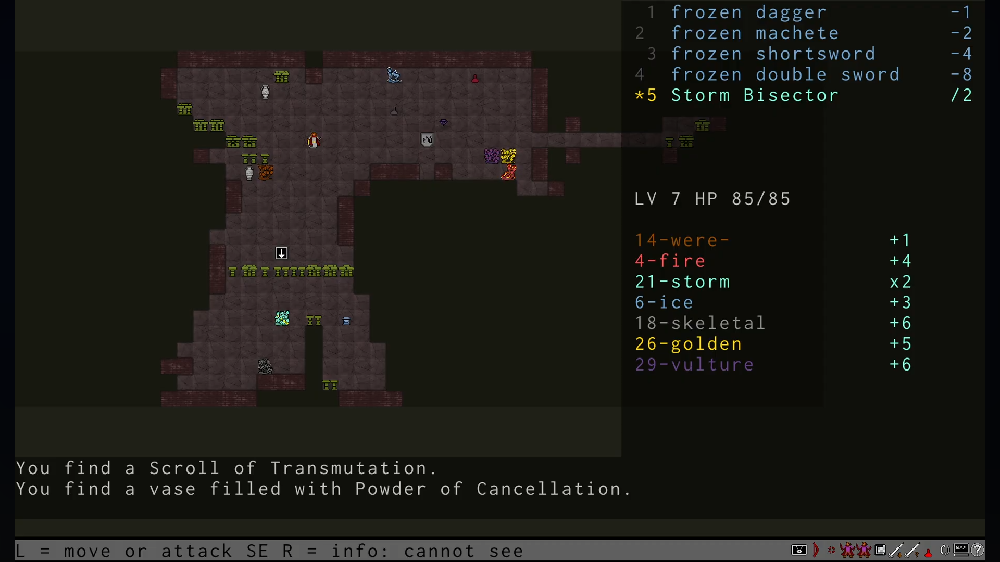
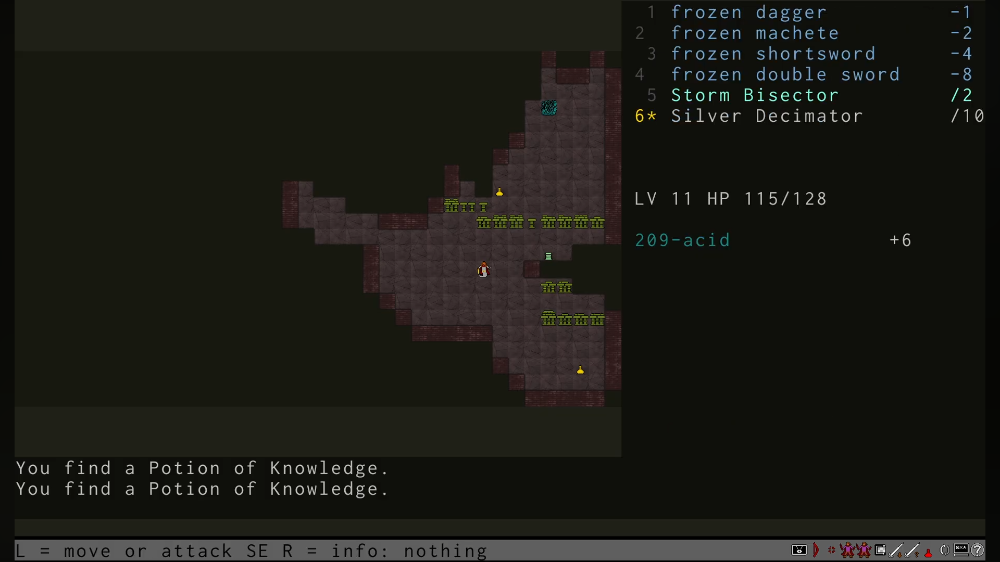
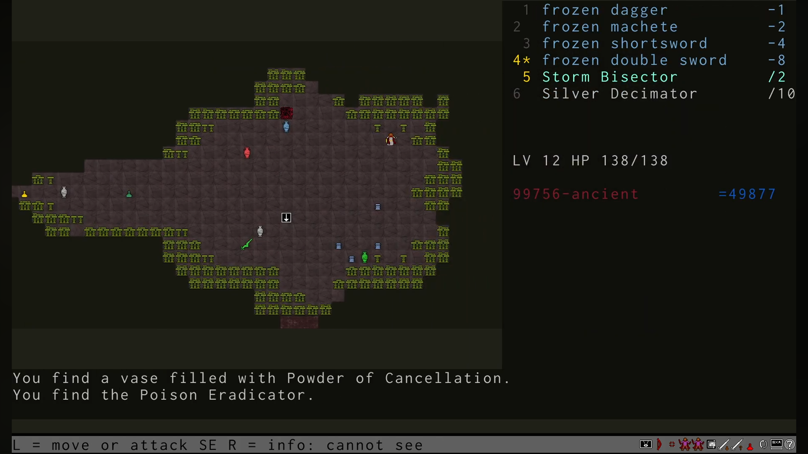

## Quick Overview

С этой игрой я уже знаком - играл в неё давно, может, когда только вышла. Даже дошёл до первого босса, а может, и победил - сейчас уже не помню. Тогда играл за Echidna: на мой взгляд, это самый простой класс, там совсем базовая арифметика.

Сейчас хочу играть за человека - чтобы получше погрузиться в разные оружия и материалы. Другие классы даже пробовать не хочу: боюсь, будет слишком сложно.

Пройти игру, наверное, будет очень тяжело. Она честная - никакого рандома. Только тактика для каждого боя. Никаких надежд на случайное зелье, свиток или что-то подобное. Только математика. От этого и продолжительность забега сильно зависит: чем медленнее считаешь, тем дольше проходишь.

Пока вообще не понимаю, как использовать оглушающее оружие. Нужно ли оно для чего‑то ещё, кроме как уменьшить входящий урон? В общем, надо разбираться.

## First Death

Игра за человека, 9‑й этаж. Я только спустился - и тут рядом сразу четыре гидры, голов от 5 до 40. К этому моменту у меня шесть оружий, но сопротивление к ним у гидр уже довольно серьёзное.

Я толком не тратил Scrolls of the Big Stick - ещё не понял, что оружия с заточкой на 7 слишком слабые: сопротивления растут быстрее, чем поднимаешься по этажам.

Меня разнесли быстро - буквально за минуту после спуска. Пока я думал, как справиться с гидрой всего на 5 голов, остальные окружили и вынесли за три хода.

Никаких предметов не использовал. Сейчас, пересматривая этот момент, даже facepalm не хочется делать - просто печаль. Куда я так спешил - непонятно.

## What I Learned After the First Hour

Первые этажи даются очень легко, тут думать и не нужно: выбираешь оружие, которое срубит все головы разом, и этаж пройден. Но из положительного - первые уровни не такие страшные, как мне казалось: вполне можно пробежать без проблем.

А вот дальше начинается интересное. Я думал, у гидр будет сопротивление только паре элементов, которые повышают количество голов. Я был неправ. Сопротивление - всем элементам, кроме одного. И растёт оно очень быстро. Так что оружия на 5–6 голов уже через 15 минут игры недостаточно: гидры начинают восстанавливать по 7–8 голов. А рук всего 4, подобрать нужные оружия пока сложно. Даже на 6‑м этаже уже становится сложно: много расходников, но подобрать нужные - проблема. Умер уже раз 5 и даже не близок к первому боссу. Вроде всё просто, всё понятно, но пока что игра никак не складывается.

Оглушение не такое страшное, как могло показаться. Я взял топор, и вполне получается им орудовать. Важна позиция персонажа: можно немного отступить и подождать, пока оглушённые головы восстановятся, прежде чем получится их срубить.

Рук мало, всего три: одна для топора, две другие - для обычного оружия. Больше всего волнует, что однажды математика окажется не на моей стороне и я не смогу победить гидру, как бы ни пытался. Пока такого не было: всего лишь раз мне пришлось заменить одно оружие на такое же из другого материала.

Был ещё щит, не знаю, насколько он нужен. Понижение урона - это хорошо, но на это потратится целый слот. Слишком расточительно.

Ещё слишком много лута на уровнях. Это пугает: непонятно, что и как использовать. Пригодится, когда нужно будет подумать. Тут можно и десять минут размышлять над ходом из‑за обилия возможностей.

## What I Learned After the Five Hours

Из интересных противников пока только vulture hydra реально напрягает - у неё просто гора сопротивлений. Первый раз решил не рисковать и добил через stunning + decapitated potions. Достижение, правда, не дали.

Во второй раз пошёл через одно stunning, остальное добил обычными оружиями. Тут-то и понял, что невнимательно прочитал правила: оказывается, убивать гидру под станом - это вроде как не по‑честному, не «уважительно».

И только в третий раз прошёл чисто оружием - и наконец‑то выбил достижение.

За человека дошёл до 22‑го уровня - это уже круто, даже успел застать другую топологию этажей. Но до полного прохождения ещё как до Луны.

Игра оказалась куда длиннее, чем я рассчитывал. 50 этажей - это реально перебор.

## What I Learned After the Ten Hours

Сначала просто поворчу: Eradicator - полный провал. Его дают всего один раз за игру, на 12‑м этаже, прямо рядом с первым боссом. Выглядит как прямая подсказка: бери и используй, как в обычных играх, где возле сильного врага сразу дают самое мощное оружие.

А тут - облом. Его просто нельзя применить. Я даже дважды использовал Powder of Growth, но на третий раз здоровья уже не хватило. Пришлось тратить дорогие Potions of Life. И даже после двух Powder of Growth Eradicator всё равно не сработал. Вот это waste, обидно до зубовного скрежета.

Прошёл игру за Echidna - та ещё гриндилка. 50 этажей, минимум по 10 гидр на каждом: выходит около 500 гидр, и почти все убиваются по одной и той же схеме. Никакой особой вариативности.

Не повезло с лутом: самые интересные оружия так и не выпали. Очень хотелось пустить в ход Syracuse Blade на финальном боссе. Ни Co Sector, ни Quick Sword не попалось. Vorpal Blade, может, и мелькал где‑то, но я его не взял. В итоге почти все Potion of Knowledge ушли на невидимых гидр.

Arch‑Hydra особо себя не проявили - по крайней мере, я не заметил ничего эпичного. Мне повезло: у всех было 50 голов или меньше, так что падали они быстро, без драмы.

Мой план - пройти первого босса за каждую расу. Игра у меня в загашнике уже 13 лет, пора закрыть этот гештальт и успокоить свою внутреннюю гидру.

## What I Learned After the Fifteen Hours

Гидры валятся одна за другой. Позади Centaur, Human, Echidna, Titan и Atlantean. За каждую расу я убил первого босса.

Тяжелее всего пока что дался Titan. Даже не подозревал что я так сильно зависим от предметов. Дополнительную сложность добавляло то что даже если просто посмотреть инвентарь это засчитывалось за ход. Как только я узнал что можно смотреть как предметы из инвентаря отразятся на конкретной гидре не пропуская ход, стало попроще.

А еще поскольку можно заранее посчитать какие оружия будут нужны для убийства гидры, ничто не мешает взять в свободные руки щит.

А вот для оглушающего оружия и для Titan не нашлось места. Возможно с Titanic Club дело обстоит иначе. Как вижу, рекомендуют сливать на нее все свои Scroll of the Big Stick, так что должно быть полезно.

Осталось пройти за Twins. Я настолько привык играть за одного персонажа, что даже пробовать немного боязно. Подозреваю что тактика для них будет сильно отличаться от привычной игры.

Но ничего не поделать, последняя раса и я свободен.

## Becoming the Hydra (Story of a Single Run)

### Going down

Древние монстры, гидры, вернулись. Сколько наших пытались отбиться - никто не вернулся. Слышала эти истории с детства, а теперь вижу следы: брошенные копья, застывшие в пепле щиты.

Люди пытались бить их обычным оружием. Но на каждую отрубленную голову вырастали новые. Я видела это своими глазами: меч рубит, головы падают, а из обрубков уже пробиваются новые.

Пришло время вспомнить позабытое искусство боя с гидрами. Не легенды для детей, а настоящую науку: длинный меч может срубить ровно пять голов. Не больше, не меньше. И если этого не хватит, чтобы добить тварь, вырастут новые головы. Вопрос в том, сколько.

Учитель говорил странное: иногда нужно сделать гидру сильнее, и только так её можно сразить. Тогда я не понимала. Теперь начинаю.

Мой род отличается от людей. Мы - Echidna, прирождённые бойцы, ловко орудуем обеими руками. Но у всего есть цена. Когда боги лишили нас ног, мы стали двигаться медленнее, будто земля сама держит нас за пятки.

Сегодня я - избранная нашего рода, на мне этот великий подвиг. И сейчас, стоя перед вратами, я чувствую: настало время показать, на что мы способны. Даже если придётся заплатить ещё чем‑то.

### Level 1

Я взяла с собой только по одному оружию в каждой руке. Оружие не должно быть в сумке. Если идёшь убивать - так доставай его.
А я тут только ради убийств. Договориться с гидрами не получится - они не ведают ни жалости, ни слов, будто сами Эринии вдохнули в них одну лишь ярость.

С собой у меня ice dagger. Руке очень холодно его держать, будто сжимаю осколок зимы, что Гефест сковал в своих кузницах. Говорят, что можно заморозить шею раньше, чем отрастут новые головы. Но это всё сказки.

И ash machete. Да, оружие из дерева. Кто бы мог подумать, что наши тренировочные мечи окажутся полезными в настоящем бою.

Не стоит его недооценивать. Я точно знаю, что оно полезно против skeletons, но, говорят, есть и мощные гидры, которые его боятся - будто даже чудовища помнят, как священные дубы трещали под топорами героев древности.

Скорее бы найти их.

Как спустилась, осматриваюсь вокруг.

Вот они, создания прямиком из ада, будто вырвались из самых тёмных глубин Тартара.

Первая на моём пути - гидра с одной головой. Если это вообще можно назвать гидрой. Гигантский слизняк.

Она покрыта белой чешуёй. Все шесть когтей этой гидры блестят белым, будто бы из чистого серебра - словно Арг, древний мастер, выковал их для какого‑то забытого бога.

Но внешний вид обманчив. Она только и ждёт, чтобы напасть. Нужно бить первой.

Кинжал легко пробивает чешую. Немного силы - и единственная голова падает на землю. Это было просто.

Следом за ней - гидра из чистого льда. Под землёй не так холодно, но она и не собирается таять. Снег остаётся там, где она проходит, будто сама зима оставила свой след.

Взмах - и она повержена.

Из‑за угла выходит гидра, с когтей которой капает противная жидкость. Там, куда падает капля, земля становится выжженной - словно сама Гея стонет от этой отравы.

Тоже для меня не сложно.

У этого головастика большой хвост с зелено‑голубым мехом. Когда он волочится по земле, слышен треск и летят искры. Маленькие молнии разлетаются в стороны, когда она двигает головой, будто небо злится на её существование.

Когда я вонзилась в неё, лёгкий заряд прошёл по моему телу. Не страшно.

Уже лучше. У этой гидры две головы. Вся грязная и мокрая, с неё течёт зелёная жижа. Об такую даже мараться не хочется.

Удар machete - и дело готово.

Я думала, моя первая гидра была красивой. Но эта блестит, как солнце. Чешуя словно отлита из золота - будто Гелиос оставил на ней отсвет своего пути. Уже представляю, как эти чешуйки будут смотреться на моей броне.

Три головы. Хоть что‑то похожее на гидру.

Одним оружием такую мне не сразить. Буду бить сразу обеими руками - тогда в один момент срублю все три головы, будто отсекаю змеиные головы, как в старых легендах о героях.

Да. Сработало.

Вижу перед собой скелет гидры. Я такие видела у богачей в их коллекциях. Но эта особенная - она живая. Сколько же в ней костей…

Не сомневаюсь, что способности по отращиванию конечностей у неё не хуже, чем у остальных. Пытаться сломать скелет бесполезно - на это не буду тратить время. Сношу головы, и останки падают замертво.

В подземелье нахожу то, что должно мне помочь, - Power Juice. Эссенция из крови гидр. Слишком редкая, чтобы найти её вне подземелья, будто нектар, который боги берегут для самых отчаянных испытаний.

Да, она сделает меня похожей на гидру. Но такова цена спасения.

Чуть пробую. На вкус даже немного сладкое. Нектар нельзя выпить наполовину. Пути назад нет.

Едва я делаю последний глоток, как чувствую, что моё тело преображается.

Что‑то пробивается сквозь кожу. Ещё одна правая рука. Пробую помахать ею. Не уступает прежней.

Осталось только вооружить её. Среди тел воинов нахожу sabre. Acid. Должно отлично справляться против гидр из металла. Будет мне в помощь - словно клинок, закалённый в кислотных водах Стикса.

Следующая гидра больше похожа на млекопитающее. Покрыта не чешуёй, а толстой коричневой шерстью. Единственная голова жутко напоминает человечью, будто сама Эхо оплакивает эту искажённую форму.

Избавлю мир от этого кошмара.

Горящая гидра. Из пасти идёт дым. Подбираться к ней близко опасно. Мы, Echidna, не любим жару. Но на мне нечему гореть, так что бояться нечего - пусть пламя бьёт, как гнев Гефеста, я устою.

Три головы слетают одним ударом sabre.

Это, должно быть, последняя. Самая странная. Все головы выглядят по‑разному. И даже меняются прямо пока я на неё смотрю. Это безумие. Но она передо мной.

Пусть меня это не смущает. Добить каждую из них. Какими бы они ни были.

### Level 2

Acid sabre - это, конечно, круто, но мне нужны оружия со степенью двойки. Так, используя все свои руки для одной мощной атаки, я смогу срубить любое количество голов.

Как повезло, что сразу после спуска лежит frozen shortsword. Говорят, такие клинки ковали ещё в кузницах Гефеста - будто лёд сам держится на стали, не тая даже в пекле подземелий. Итого у меня теперь оружие на одну голову, на две и на четыре. Гидры меньше чем с восемью головами мне не страшны.

А вот и первая гидра - с четырьмя головами. Тут даже не нужно быть амбидекстром.

Горящая тварь с шестью головами. Даже не будь я таким ловким бойцом, шансов против льда у неё не было бы. Остужаю обрубки шеи - пар поднимается, будто над раскалённым железом, и гидра оседает, теряя силу, словно угасает уголёк в ледяной воде.

### Level 3

Were hydra с семью головами. Это мой предел пока что. Легко справляюсь с ней.

Девятиголовая гидра. Это больше, чем я могу срубить за раз. Придётся сделать два удара.

В первый раз меня укусили. Рваная рана осталась на теле. Кровь гидры лечебная - немного заживлю раны.
Нас, Echidna, кровь гидр лечит слабее. Нужно поменьше пропускать ударов.

Я значительно медленнее гидр. Из‑за угла в любой момент может выскочить новая и ударить первой.
Нужно выжидать. Гидры явились не просто так. Они не будут ждать - они рвутся на свободу, в наш мир, будто сами титаны вновь пробудились в недрах земли.
Единственный проход наверх я сторожу. Придут сами.

Вижу frozen machete. Пришло время поменять свой ash machete на новый.
Теперь я бью только холодом.

Да, против ледяных гидр будет непросто. Но зато все остальные будут отращивать новые головы лишь раз за мою атаку.
Магия гидр в том, что они отращивают головы не за каждую срубленную, а за каждую применённую против них стихию. Сколькими бы оружиями я ни била - счёт идёт на магию, а не на удары, как будто сама Гея питает их ярость.

### Level 4

Potion of Power Juice. Ещё одна рука, в этот раз левая. Говорят, такой дар бывает только у тех, кто прошёл испытание у врат Аида - не знаю, правда ли это, но сейчас мне всё равно.

Впереди маячит гидра с десятью головами. Подберу в новую руку flaming sword. Магия двух стихий в моих руках - словно держу в ладонях огонь Гелиоса и дыхание Борея.
До тринадцати голов одним махом.

Двенадцать голов хаоса. Мешанина из лиц и шей. Быстро же они набираются сил. Я всего на четвёртом этаже, а уже такие чудовища - будто сама Тартар выплёскивает свои кошмары всё выше и выше.

### Level 5

Надо же, человек. Возможно, кто‑то из бойцов выжил.

Но у него две головы. Говорить не может.

Сильно вооружён.

Остерегается меня. Я могу лишить его обеих голов сразу. Значит, разум ещё остался. В отличие от гидр - те давно потеряли всё человеческое, будто сама Мойра перерезала их нить рассудка.

Подхожу ближе и получаю удар. По‑другому с такими, видимо, никак.

Ещё одна рука. Моё вооружение растёт быстрее голов. Это очень хорошо.

### Level 6

Я ошиблась. Двадцать две головы. Придётся использовать Scroll of the Big Stick, чтобы наточить оружие - будто древние кузнецы вновь дышат на сталь, возвращая ей забытую остроту.

Теперь у меня оружие, которое срубает 1, 2, 4, 8 и 7 голов. Должно хватить.

Ухты, что я нашла. Storm Bisector. Вычитать головы по одной слишком затратно. Растут они слишком быстро, словно змеиные клубки под взглядом Медузы.

Пришло время делить.

Это оружие сносит половину голов у гидры. Теперь я готова к такому их росту.

### Level 7

Открытое пространство, и гидры со всех сторон. Нужно быть очень осторожной.

Отбиваюсь от гидр, которые слишком близки ко мне, и прячусь в грибы. Подходите по одной, твари. Пусть думают, что загнали меня в угол, - но даже в тени можно нанести удар.

Новая гидра. Такой я раньше не видела.

Это родственник стервятников, которые ели печень Прометея. Из‑за этого у неё особая сила. Она отращивает головы не только когда ей срубают голову, но и когда атакует - будто сама боль питает её, как нектар питает богов.

Растёт в два раза быстрее.

К сожалению, у неё 29 голов. Поэтому поделить их я не смогу. Придётся что‑то придумывать.

Бросаю в неё Powder of Growth. Голов становится 36.

Гидра быстрее меня. Пока я бросала порошок, она успевает меня укусить.

Я в панике бью без делителя.

Голов теперь 46. Очень много.

Бью всеми оружиями. Теперь голов 21. Не хватает моего оружия, чтобы снести их все. Получаю ещё укус.

12 голов. Удар из последних сил - и вот моя первая vulture hydra пала, будто рухнул идол, которому поклонялись в забытых храмах.

У таких мощных гидр кровь особенно целебная. Даже для меня. Раны заживают на глазах - словно сама Гея смывает боль, хоть и не дарит покоя.

### Level 8

Ледяная гидра сильно меня подбила. Никак не получалось её быстро поделить. Здоровья уже половина.

В этом минус всего ледяного оружия - оно будто сковывает руку, замедляя удар, словно сама зима цепляется за клинок. Но будь оно другим, были бы сложности с другими гидрами - каждая стихия тянет за собой свою беду.

Нужно вооружаться больше.

Повезло отрастить ещё пару рук. Теперь их у меня шесть. Чувствую каждую - будто не новые конечности, а старые товарищи, вернувшиеся в строй.

Подбираю Two‑Handed sword. Руки хоть и новые, но сил у них много. Могу держать в одной руке такой тяжёлый меч - он ложится в ладонь, как будто был выкован именно для этих шести рук.

Справлюсь.

### Level 9

Стервятник на сорок девять голов. Что‑то не так с моим делителем. Нужен ещё один.

А вот и ещё один - Trisector. Теперь я покрываю делителями, когда голов становится слишком много, будто пытаюсь удержать в руках рассыпающиеся нити судьбы.

### Level 10

Я таких гидр раньше не видела. Она вся покрыта спекшейся кровью и грязью. Надеюсь, это не кровь бывших воинов - не хочу думать, что сражаюсь среди останков тех, кто пытался сделать то же самое.

Смотрю на когти и не вижу, чтобы можно было её опознать.

Пасти закрыты. По ним тоже непонятно.

Буду бить наугад. Всего пять голов, так что справлюсь легко.

Гидра хаоса. Можно было и догадаться - они всегда прячутся за грязью и тишиной, чтобы ударить, когда ты перестанешь ждать.

На земле лежит легендарное оружие - Decimator. Одним ударом делит головы на 10.

В самый раз для больших гидр. Я точно знаю, что он мне будет нужен. Пока что не так критично, но головы продолжают расти, будто сами титаны шепчут им: «Ещё, ещё».

### Level 11

209 голов у гидры. Какой резкий скачок. Делением на два и на три тут было бы не обойтись - будто сама Гидра перехитрила все законы счёта, насмехаясь над моими делителями.

Пройдусь по шеям своим новым оружием. Но только когда смогу округлить немного - пусть эти лишние головы станут удобной мишенью, будто неровные камни, которые герой сбивает с тропы, чтобы пройти дальше.

Придётся стерпеть урон. Пусть бьют - я не для того прошла столько этажей, чтобы отступить перед числом, которое не помещается в уме.

Моя первая гидра, у которой больше сотни голов. И больше значительно. Будет о чём рассказать, когда выберусь на поверхность - если кто‑то вообще поверит, что я стояла перед чудовищем, чьи головы можно было считать только по десяткам, словно волны, бьющие о скалы у берегов Аида.

### Level 12

Подозрительная тишина на этаже. Обычно всюду летят искры, огонь из пастей, воздух дрожит от рёва. А здесь - ни звука. Даже пол будто застыл, как перед ударом грома.

Пока я не заметила чудовище.

Сложно подсчитать даже, сколько у неё голов.

99 756.

Больше, чем я могла себе представить. Гидры и до этого росли, но не так же быстро - будто кто‑то в самом сердце подземелья крутил колесо судьбы, выжимая из него максимум.

С такой гидрой бой будет долгим. Если бы не одно «но».

На земле лежит Eradicator. Оружие, о котором слагали легенды - будто его ковали не в кузницах смертных, а в чертогах богов, и даже те шептались, что оно слишком дерзко для этого мира.

Извлекает корень из голов. Проверить, подойдёт ли оно, я не могу - слишком сложно вычислить, когда цифры уже лезут из глаз. Понадеюсь на чудо. Или хотя бы на удачу, которой у меня сегодня и так почти не осталось.

Гидра быстрее меня, поэтому сразу выпиваю Potion of Extreme Speed. Сердце колотится где‑то в горле, мир становится резким, будто кто‑то выкрутил резкость до предела.

Так‑то лучше. Смогу добежать до оружия раньше, чем меня настигнет гидра.

Беру Eradicator и пробую поделить гидру. Не выходит. Магия не подходит - словно клинок звенит впустую, не находя отклика в этом безумии из голов.

Сомневаюсь. Может, голов слишком мало? Или, наоборот, слишком много - столько, что сама арифметика ломается.

Кидаю в неё Powder of Growth.

Гидра пытается меня укусить. Такое количество голов больше, чем она в состоянии контролировать. Они мешают друг дружке, сталкиваются, путаются - будто толпа безумцев, каждый из которых тянет в свою сторону. Только дюжина из них смогла меня зацепить.

Eradicator снова не работает. Проклятие. Я чувствую, как внутри всё сжимается от досады - будто держала в руках ключ от двери, а он не поворачивается.

Пробую ещё раз добавить гидре голов.

Ещё удар по мне. Во рту вкус крови, солёный и резкий. Долго я так не выдержу. Ноги уже тяжелеют, каждый вдох отдаётся болью.

И снова Eradicator меня подводит. Боги не были готовы к столь мощному оружию - или не хотели, чтобы оно сработало в руках такой, как я.

Придётся бить обычным. Пусть это будет не изящно, не по легенде, а просто, по‑солдатски: тяжело, прямо, до конца.

Четыре раунда с Decimator - и гидра падает на землю, сотрясая пол, будто рушится гора. Грохот прокатывается по подземелью, и на секунду кажется, что даже тишина здесь теперь другая.

Опасность для мира миновала.

Или нет?

Среди леса из грибов вижу, что есть спуск ниже. Хотя куда, казалось бы… Ещё глубже, ещё темнее.

Я не могу вернуться и сказать, что сдалась. Не после всего этого. Нужно идти до конца - даже если конец уже не помещается в голове.
